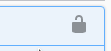

# Cvičenie z predmetu číslicový prenos dát

## Zadanie č.1:

Cieľom cvičenia je oboznámiť sa s REST rozhraním. Na úvod cvičenia sa musíme oboznámiť s pojmom REST rozhranie a ďalšími termínmi a technológiami, ktoré sa použijú pri vypracovaní tohoto cvičenia( preštudujte sekciu Teória).

Prvá časť úlohy je formou tutoriálu, ktorý má za cieľ oboznámiť vás so základom problematiky návrhu aplikácie s použitím HTTP klienta, JSON formátu na prenos dát a Maven systému na zostavovanie aplikácie. Potom nasledujú úlohy na [samostatnú prácu](./postup/#uloha-na-dopracovanie), ktoré treba **povinne vypracovať a odovzdať** vo forme Git repozitára.  Na záver je [dobrovoľná úloha](./bonus/#dobrovolna-uloha) a jej vypracovaním si môžete zlepšiť známku.

Úlohou na vypracovanie je vytvoriť základnú klientskú aplikáciu, ktorá bude využívať REST rozhranie na načítanie dát o počasí. Web služba, ktorá poskytuje tieto dáta beží na serveri, ktorý je pripravený tak, že bude bežať na lokálnom počítači a vyvíjaná aplikácia k nemu pristúpi cez lokálne pripojenie. Klientská aplikácia bude využívať [Retrofit](https://square.github.io/retrofit/), čo je vlastne HTTP klient. Prenášané dáta sú vo forme JSON, ktorý bude treba deserializovať na čo sa bude používať [Jackson](https://github.com/FasterXML/jackson) knižnica. 
> Ilustrácia úlohy
> 

## REST rozhranie webovej služby

Na serveri existuje táto URL adresná schéma:

- Získanie informácií o dostupných meteorologických staniciach 

    `GET   /weather/locations`

- Získanie dát o aktuálnom počasí z konkrétnej stanice. Nahradením `{station}` id konkrétnej meteorologickej stanice definujeme meteo stanicu od ktorej si dáta vyžadujeme.

    `GET   /weather/{station}/current`

- Získanie historický dát o  počasí z konkrétnej stanice. Nahradením `{station}` id konkrétnej meteorologickej stanice definujeme meteo stanicu od ktorej si dáta vyžadujeme.

	`GET   /weather/{station}/history`
	
- Získanie prístupového tókenu, ktorý je potrebný na prístup k zabezpečeným zdrojom. Prístup k tomuto zdroju je zabezpečený pomocou [Basic access authentication](https://en.wikipedia.org/wiki/Basic_access_authentication). Prístupové údaje: `admin:heslo`

	`POST /apikey/createjwt`
	
- Tieto adresy majú rovnakú funkcionalitu ako `/weather` adresy ale prístup k nim je zabezpečený [JWT](https://jwt.io/) tokénom, ktorý treba pribaliť do hlavičky požiadavky `Authorization: <token>` 
    `GET   /weatherAuth/locations`<br>
    `GET   /weatherAuth/{station}/current`<br>
    `GET   /weatherAuth/{station}/history`<br>
    
- Špeciálna adresa na ktorej je umiestnená interaktívna dokumentácia k REST rozhraniu. Táto umožňuje otestovať jednotlivé URL adresy.

    `GET   /swagger`

!!! Tip
	Na overenie zabezpečených URL adries sa v interaktívnej dokumentácii swagger dá autentifikovať  kliknutí na tieto ikonky:<br>
	 

### Webová služba vo vnútri Docker kontajnera

Samotná webová služba je napísaná v Java jazyku s využitím Dropwizzard frameworku a Jetty webového servera. Pre zjednodušenie a zaistenie kompatibility je táto služba zabalená do Docker kontajnera, ktorý zabezpečuje jednotné behové prostredie na každom operačnom systéme (Windows, Linux, Mac). 

#### Inštalácia Docker

- [Windows](https://docs.docker.com/docker-for-windows/install/)
- [Linux](https://docs.docker.com/engine/install/#server)
- [Mac](https://docs.docker.com/docker-for-mac/install/)

!!! tip
	V prípade, že vám nejde Docker nainštalovať, môžete využiť online skúšobné prostredie: [Docker playground](https://labs.play-with-docker.com/). Toto prostredie umožňuje spustiť docker image, pričom jedno sedenie môže trvať maximálne 4 hodiny.
    Pri využití tejto možnosti si treba zmeniť v príklade všetky `localhost` adresy za adresu virtuálneho servera na ktorom beží docker image.  **Táto adresa je dočasná a je platná iba počas 4 hodinovej session. Prikaždom spustení novej session sa vygeneruje nová adresa**
	
	
	Príklad adresy swagger:`http://ip172-18-0-131-bqsjeliosm4g00fisf3g-9000.direct.labs.play-with-docker.com/swagger`


### Stiahnutie obrazu webovej služby

V príkazovom riadku zadajte:
```bash
docker pull hudikm/dropwizard-weatherstation
```

### Spustenie služby
V príkazovom riadku zadajte:

`docker run  -e TZ='Europe/Bratislava' -it -p 9000:8080 -p 9001:8081 hudikm/dropwizard-weatherstation`

Bližšie si rozoberme daný príkaz:

```bash
docker run              - spustenie kontajnera
-e TZ='Europe/Bratislava' - nastavenie časovej zóny v akej kontajner bude bežať
-it                     - pripojenie terminálu aby sme vedeli čo sa deje
-p 9000:8080            - prepojenie lokálneho portu 9000 na port kontajnera 8080
-p 9001:8081            - prepojenie lokálneho portu 9001 na port kontajnera 8081
hudikm/dropwizard-weatherstation - názov obrazu, ktorý sa má spustiť
```

Po spustení daného príkazu by mala nabehnúť webová služba WeatherStation. Otestovať to môžeme otvorením stránky dokumentácie swagger: `http://localhost:9000/swagger` 

