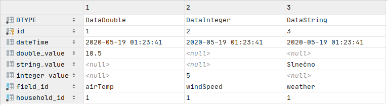

Na adrese [`https://github.com/hudikm/HouseHoldService_CPD2020`](https://github.com/hudikm/HouseHoldService_CPD2020)  sa nachádza šablóna projektu. Rovnakým postupom ako v zadaní 1 vytvorte vo svojom GitHub učte kópiou projektu a naklonujte si projekt na lokálny počítač. 

!!! warning "Názov projektu treba zmeniť na '*HouseHoldService*'"
	
	Ak sa nechá pôvodný názov `HouseHoldService_CPD2020` bude treba v konfigurácii projektu zmeniť názov. 

!!!note "Spustenie MariaDB" 
	Databáza je spustená pomocou docker obrazu.
    Príkaz na spustenie: `docker-compose up` musíte sa nachádzať v projektovom adresári kde sa nachádza súbor `docker-compose.yml`. 

<!--tgen file='/home/martin/IdeaProjects/WeatherStation/HouseHoldServiceCopy/out.patch' lang=java tabs t_new="Nové" t_old="Pred úpravou" headerRegex="^(?:\t| )*(?:(?:public)|(?:private)|(?:static)|(?:protected))" -->

<!--____tgen step=all template='gen_tags_separate_header'  -->

<!--tgen step=1.0 template='files_list' noupdate  -->
####1.0 Vytvorenie REST rozhrania HouseHoldResource [:link:](https://github.com/hudikm/HouseHoldService_CPD2020/commit/42ca9531dc851212ea51475cc5b42382ebbbce83/)

```bash
 .
 └─ src
    └─ main
       ├─ resources
       │  ├─ banner.txt
       │  └─ hibernate.cfg.xml #Konf. hibernate knižnice(len na gen. vizuálnych diagramov)
       └─ java
          └─ sk
             └─ fri
                └─ uniza
                   ├─ resources # Implementácia REST rozhrania
                   │  ├─ FieldResource.java
                   │  ├─ HouseHoldResource.java
                   │  └─ IoTNodeResource.java
                   ├─ model # Dátový model
                   │  ├─ AbstractData.java
                   │  ├─ ContactPerson.java
                   │  ├─ DataDouble.java
                   │  ├─ DataInteger.java
                   │  ├─ DataString.java
                   │  ├─ Field.java
                   │  ├─ HouseHold.java
                   │  └─ IotNode.java
                   ├─ health # Pomocné triedy na rôzne testy
                   │  └─ DatabaseHealthCheck.java
                   ├─ db # Databázové objekty určené na prístup k databáze
                   │  ├─ DataDAO.java
                   │  ├─ FieldDAO.java
                   │  ├─ HouseHoldDAO.java
                   │  └─ IotNodeDAO.java
                   ├─ core # Pomocné triedy
                   │  ├─ DateFormat.java
                   │  ├─ DateParameterConverter.java
                   │  ├─ DateParameterConverterProvider.java
                   │  └─ DateTimeFormat.java
                   ├─ api # Pomocné triedy
                   │  └─ FilterEnum.java
                   ├─ HouseHoldServiceApplication.java # Vstupná trieda aplikácie
                   └─ HouseHoldServiceConfiguration.java # Konfiguračná trieda
```


<!--end-->

<!--tgen step=1.0 template='mkdocs_header_only'  -->
<br/>

#### 1.0 Vytvorenie REST rozhrania HouseHoldResource [:link:](https://github.com/hudikm/HouseHoldService_CPD2020/commit/42ca9531dc851212ea51475cc5b42382ebbbce83/)

<!--end-->

Podľa zadania máme vytvoriť webovú službu s využitím REST rozhrania na komunikáciu. REST rozhranie má obsahovať rôzne URI adresy, ktoré poskytnú prístup k jednotlivým zdrojom s využitím HTTP metód. Na začiatok si implementujeme jednoduchý koncový bod `GET /household/{id} `, ktorý poskytne údaje o konkrétnej domácnosti `HouseHold`. Tento koncový bod bude súčasťou kolekcie viacerých koncových bodov, ktoré budú dostupné na URI adrese `/household` . Každá REST trieda zdrojov musí obsahovať definíciu URI adresy, v tomto prípade sa na tento účel používa anotácia `@Path()`. Anotácie `@Produces, @Consumes`slúžia na definovanie formátu prenášaných dát. Táto informácia bude súčasťou každej HTTP hlavičky.

<!--tgen step=1.0 template='mkdocs_body_only' noupdate -->

>  **[🖹](https://github.com/hudikm/HouseHoldService_CPD2020/blob/42ca9531dc851212ea51475cc5b42382ebbbce83/src/main/java/sk/fri/uniza/resources/HouseHoldResource.java) src/main/java/sk/fri/uniza/resources/HouseHoldResource.java**

``` java tab="Nové" hl_lines="3 4 5 6"
)

@Path("/household") // Koreňová adresa kolekcie koncových bodov
    				// pre prístup k zdrojom domácností // Súčasť JAX-RS
@Produces(MediaType.APPLICATION_JSON)// Výstupné dáta sú vo forme JSON //JAX-RS
@Consumes(MediaType.APPLICATION_JSON) //Vstupné dáta sú vo forme JSON //JAX-RS
public class HouseHoldResource {

    private HouseHoldDAO houseHoldDAO;

```

``` java tab="Pred úpravou" 
)

public class HouseHoldResource {

    private HouseHoldDAO houseHoldDAO;

```

Samotný koncový bod je definovaný ako kombinácia HTTP metódy a URI adresy, v tomto prípade `@GET` a `@Path("{id}")`. Pri definícii URI adresy môžeme definovať premenné, ktoré si vyžiadame ako vstupné parametre v metóde pomocou anotácie `@PathParam`. Dátový typ takejto premennej je spravidla jednoduchý (napr. `Long, Integer, String`)  . Návratová hodnota metódy koncového bodu definuje výstupný zdroj, v tomto prípade sa jedná o údaje o domácnosti reprezentované triedou  `HouseHold`. Tento objekt je automaticky serializovaný do požadovanej podoby.

!!! note 
    Dropwizárd používa interne Jackson knižnicu na serializáciu/deserializáciu objektov na a z JSON formátu.

 > public class HouseHoldResource {

``` java tab="Nové" hl_lines="4 5 6 9 10"
        return null;
    }

    @GET //HTTP metóda
    @Path("{id}") // Jedna vetva hlavnej adresy /household
    @UnitOfWork //Otvorí novú hibernate session

    public HouseHold getHouseHold(
            @PathParam("id") Long id) {
        return new HouseHold();
    }


```

``` java tab="Pred úpravou" hl_lines="6 7"
        return null;
    }


    public HouseHold getHouseHold(
            Long id) {
        return null;
    }


```

<!--end-->

<!--tgen step=1.1 template='mkdocs_header_only'  -->
<br/>
#### 1.1 Zaregistrovanie prvej časti REST rozhrania [:link:](https://github.com/hudikm/HouseHoldService_CPD2020/commit/7a105a33d1a13887d5848c64ab32192a9f608de7/)
<!--end-->

V Dropwizard-e je nutné každú triedu, ktorá je súčasťou REST rozhrania a poskytuje prístup k zdrojom zaregistrovať do  RESTovej knižnice [`Jersey`](https://eclipse-ee4j.github.io/jersey.github.io/documentation/latest/index.html). Táto knižnica implementuje štandard JAX-RS (JSR-370).

<!--tgen step=1.1 template='mkdocs_body_only'  -->

>  **[🖹](https://github.com/hudikm/HouseHoldService_CPD2020/blob/7a105a33d1a13887d5848c64ab32192a9f608de7/src/main/java/sk/fri/uniza/HouseHoldServiceApplication.java) src/main/java/sk/fri/uniza/HouseHoldServiceApplication.java**

 > public class HouseHoldServiceApplication

``` java tab="Nové" hl_lines="4 5 6"
    public void run(final HouseHoldServiceConfiguration configuration,
                    final Environment environment) {

        // Vytvorené objekty reprezentujúce REST rozhranie
        environment.jersey()
                .register(new HouseHoldResource(null, null));
    }

}

```

``` java tab="Pred úpravou" 
    public void run(final HouseHoldServiceConfiguration configuration,
                    final Environment environment) {

    }

}

```


<!--end-->


<!--tgen step=1.2 template='mkdocs_header_only'  -->
<br/>
#### 1.2 Pridanie swagger dokumentačných anotácií [:link:](https://github.com/hudikm/HouseHoldService_CPD2020/commit/380a4574e9bb003f6fb8e203068fee70a5182349/)
<!--end-->

Swagger je dokumentačný nástroj, ktorý na základe vložených anotácii a Java reflexie vygeneruje dokumentáciu. Túto dokumentáciu je možne zobraziť v interaktívnom prehliadači, ktorý bude dostupný po spustení na adrese: [http://localhost:8080/swagger](http://localhost:8080/swagger). Táto dokumentácia sa dá použiť aj na vygenerovať kódu pre stranu klienta pristupujúce na webovej služby.

V tejto verzii Dropwizardu sa používa verzia SwaggerUI v3.23.0 a Swagger API vo verzií [1.5.22](https://github.com/swagger-api/swagger-core/wiki/Annotations-1.5.X)

<!--tgen step=1.2 template='mkdocs_body_only'  -->

>  **[🖹](https://github.com/hudikm/HouseHoldService_CPD2020/blob/380a4574e9bb003f6fb8e203068fee70a5182349/src/main/java/sk/fri/uniza/resources/HouseHoldResource.java) src/main/java/sk/fri/uniza/resources/HouseHoldResource.java**

``` java tab="Nové" hl_lines="4"
        schemes = {SwaggerDefinition.Scheme.HTTP}

)
@Api("/household") // Swagger
@Path("/household") // JAX-RS
@Produces(MediaType.APPLICATION_JSON)//Výstupné dáta sú vo forme JSON //JAX-RS
@Consumes(MediaType.APPLICATION_JSON) //Vstupné dáta sú vo forme JSON //JAX-RS

```

``` java tab="Pred úpravou" hl_lines="4"
        schemes = {SwaggerDefinition.Scheme.HTTP}

)

@Path("/household") // JAX-RS
@Produces(MediaType.APPLICATION_JSON)//Výstupné dáta sú vo forme JSON //JAX-RS
@Consumes(MediaType.APPLICATION_JSON) //Vstupné dáta sú vo forme JSON //JAX-RS

```

 > public class HouseHoldResource {

``` java tab="Nové" hl_lines="4 6"
    @GET
    @Path("{id}")
    @UnitOfWork //Otvorí novú hibernate session
    @ApiOperation(value = "Údaje o konkrétnej domácnosť")
    public HouseHold getHouseHold(
            @ApiParam(required = true)
            @PathParam("id") Long id) {
        return new HouseHold();
    }

```

``` java tab="Pred úpravou" hl_lines="4"
    @GET
    @Path("{id}")
    @UnitOfWork //Otvorí novú hibernate session

    public HouseHold getHouseHold(
            @PathParam("id") Long id) {
        return new HouseHold();
    }

```


<!--end-->

Po tomto bode si môžeme aplikáciu spustiť a vyskúšať dvoma spôsobmi:

1. V internetovom prehliadači zadáme adresu `http://localhost:8080/household/1` a dostaneme nasledovnú JSON odpoveď: `{"id":null,"city":null,"zip":null,"contactPerson":null,"data":null,"iotNode":null,"state":null,"street":null}`
2. Použijeme swagger interaktívnu dokumentáciu na adrese:  [http://localhost:8080/swagger](http://localhost:8080/swagger).

<!--tgen step=1.3 template='mkdocs_header_only'  -->
<br/>

#### 1.3 Doplnenie POST metódy v HouseHoldResource [:link:](https://github.com/hudikm/HouseHoldService_CPD2020/commit/50e567b012f960aebf408690446de526d77de591/)

<!--end-->

Obdobný spôsobom ako sme si vytvorili HTTP metódu `@GET` si vytvoríme nový koncový bod s využitím HTTP metódy `@POST` , ktorý bude slúžiť na pridanie nového objektu `HouseHold`. Keďže nedefinujeme žiadnu adresu tak tento koncový bod bude priamo na koreňovej adrese `/household`. Každá URI adresa môže obsahovať z každej HTTP metódy iba jeden exemplár, to znamená, že ak by sme potrebovali doplniť ďalšiu metódu `@POST` musíme ju umiestniť už na novú pod-adresu.  

Vstupný parameter metódy definuje ako majú vyzerať vstupné dáta. Inak povedané vstupné dáta musia byť  vo formáte JSON a musia reprezentovať serializovanú triedu `HouseHold`  

> Trieda `HouseHold` v JSON formate
>
> ```JSON
> {
>   "id": 0,
>   "street": "Univerzitná",
>   "city": "Žilina",
>   "state": "Slovakia",
>   "zip": "01008",
>   "contactPerson": {
>     "firstName": "Janko",
>     "lastName": "Hraško",
>     "phone": "0907 123 456",
>     "email": "em@mail.sk"
>   }
> }
> ```
>
> 

<!--tgen step=1.3 template='mkdocs_body_only'  -->

>  **[🖹](https://github.com/hudikm/HouseHoldService_CPD2020/blob/50e567b012f960aebf408690446de526d77de591/src/main/java/sk/fri/uniza/resources/HouseHoldResource.java) src/main/java/sk/fri/uniza/resources/HouseHoldResource.java**

 > public class HouseHoldResource {

``` java tab="Nové" hl_lines="4 5 6 8"
        return null;
    }

    @POST /*JAX-RS*/
    @UnitOfWork //Otvorí novú hibernate session // Dropwizard
    @ApiOperation(value = "Pridanie novej domácnosti")
    public HouseHold createHouseHold(HouseHold houshold) {
        return houshold;
    }

    public HouseHold updateHouseHold(

```

``` java tab="Pred úpravou" hl_lines="4 6"
        return null;
    }


    public HouseHold createHouseHold(HouseHold houshold) {
        return null;
    }

    public HouseHold updateHouseHold(

```


<!--end-->


<!--tgen step=1.4 template='mkdocs_header_only'  -->
<br/>
#### 1.4 JSON serializácia [:link:](https://github.com/hudikm/HouseHoldService_CPD2020/commit/78ccafff54f49ff28dcec35dcb74392c88a21100/)
<!--end-->

Ako už bolo spomenuté Dropwizard používa na prácu s JSON formátom knižnicu Jackson. Pre serializáciu a deserializáciu  sa využívajú rôzne anotácie. Tu je krátky prehľad základných [anotácií](http://tutorials.jenkov.com/java-json/jackson-annotations.html). 

V tomto kroku prinútime Jackson knižnicu ignorovať niektoré atribúty triedy `HouseHold`. Pre serializáciu/deserializáciu nemajú význam a tak ich zakážeme používať zapísaním anotácie '@JsonIgnore'.

<!--tgen step=1.4 template='mkdocs_body_only'  -->

>  **[🖹](https://github.com/hudikm/HouseHoldService_CPD2020/blob/78ccafff54f49ff28dcec35dcb74392c88a21100/src/main/java/sk/fri/uniza/model/HouseHold.java) src/main/java/sk/fri/uniza/model/HouseHold.java**

 > public class HouseHold {

``` java tab="Nové" hl_lines="4 5 7 8"
    private String state;
    private String zip;
    private ContactPerson contactPerson;
    @JsonIgnore // Ignorovanie danej premenej z pohladu Serializacie do
    // Objektu JSON.Gneroval by sa obrovský JSON a dochádzalo by aj k zacykleniu
    private Set<AbstractData> data;
    @JsonIgnore // Ignorovanie danej premenej z pohladu Serializacie do
    // Objektu JSON.Gneroval by sa obrovský JSON a dochádzalo by aj k zacykleniu
    private Collection<IotNode> iotNode;

    public Long getId() {

```

``` java tab="Pred úpravou" 
    private String state;
    private String zip;
    private ContactPerson contactPerson;
    private Set<AbstractData> data;
    private Collection<IotNode> iotNode;

    public Long getId() {

```


<!--end-->


<!--tgen step=1.5 template='mkdocs_header_only'  -->
<br/>
#### 1.5 JSON validácia dát [:link:](https://github.com/hudikm/HouseHoldService_CPD2020/commit/95347193e52b26b1cdd501e40be21229f3b5de8a/)
<!--end-->

Všetci vieme, že správnosť údajov je dôležitá. Preto pri každom zápise do databázy  by sme mali overiť, či prijaté dáta spĺňajú požiadavky napr. email je v správnom tvare, telefónne číslo je v dobrom formáte, zadaný popis nepresahuje maximálnu dĺžku. Toto všetko by sme mohli spraviť manuálnym `IF-ELSE` spôsobom čo by bolo pracné, chybové  a dlhodobo neudržateľné. Našťastie existujú nástroje na zjednodušenie tejto úlohy. V prípade Java prostredia tieto nástroje implementujú štandard JSR 380 a dropwizard obsahuje implementáciu `hibernate-validation`. Tieto nástroje pracujú na základe anotácii, ktoré definujú požiadavky na danú premennú.  [Krátky tutoriál na túto tému.](https://www.baeldung.com/javax-validation)

<!--tgen step=1.5 template='mkdocs_body_only' noupdate  -->

>  **[🖹](https://github.com/hudikm/HouseHoldService_CPD2020/blob/95347193e52b26b1cdd501e40be21229f3b5de8a/src/main/java/sk/fri/uniza/model/ContactPerson.java) src/main/java/sk/fri/uniza/model/ContactPerson.java**

``` java tab="Nové" hl_lines="3 4 10 11 12 17 18 19 20 23 24 25 26 29 30 31 32 33 36 37 38 39"
package sk.fri.uniza.model;

import io.swagger.annotations.ApiModelProperty;
import io.swagger.annotations.ApiParam;
import org.hibernate.validator.constraints.Email;
import org.hibernate.validator.constraints.NotEmpty;

import javax.persistence.Basic;
import javax.persistence.Embeddable;
import javax.validation.constraints.NotNull;
import javax.validation.constraints.Pattern;
import javax.validation.constraints.Size;


public class ContactPerson {

    @NotNull
    @Size(min = 2, max = 20)
    @ApiModelProperty(example = "Janko") // Príklad pre swagger
    // dokumentáciu
    private String firstName;

    @NotNull
    @Size(min = 2, max = 20)
    @ApiModelProperty(example = "Hraško") // Príklad pre swagger
    // dokumentáciu
    private String lastName;

    @NotNull
    @Pattern(regexp = "^(\\d{4}[ ]\\d{3}[ ]\\d{3}|\\d{10})$")
    //napr. 0905 123 456 alebo 0905123456
    @ApiModelProperty(example = "0907 123 456") // Príklad pre swagger
    // dokumentáciu
    private String phone;

    @NotNull
    @Email
    @ApiModelProperty(example = "em@mail.sk") // Príklad pre swagger
    // dokumentáciu
    private String email;

    public ContactPerson() {

```

``` java tab="Pred úpravou" 
package sk.fri.uniza.model;

import org.hibernate.validator.constraints.Email;
import org.hibernate.validator.constraints.NotEmpty;

import javax.persistence.Basic;
import javax.persistence.Embeddable;


public class ContactPerson {

    private String firstName;

    private String lastName;

    private String phone;

    private String email;

    public ContactPerson() {

```

>  **[🖹](https://github.com/hudikm/HouseHoldService_CPD2020/blob/95347193e52b26b1cdd501e40be21229f3b5de8a/src/main/java/sk/fri/uniza/model/HouseHold.java) src/main/java/sk/fri/uniza/model/HouseHold.java**

``` java tab="Nové" hl_lines="4 5 8 14 16 17 19 20 22 23 25 26 27 29"
package sk.fri.uniza.model;

import com.fasterxml.jackson.annotation.JsonIgnore;
import io.swagger.annotations.ApiModelProperty;
import org.hibernate.validator.constraints.NotEmpty;

import javax.validation.Valid;
import javax.validation.constraints.Pattern;
import java.util.Collection;
import java.util.Set;


public class HouseHold {
    @ApiModelProperty(hidden = true) // Swagger nebude zobrazovať atribút
    private Long id;
    @NotEmpty
    @ApiModelProperty(example = "Univerzitná") // Príklad pre swagger doku.
    private String street;
    @NotEmpty
    @ApiModelProperty(example = "Žilina") // Príklad pre swagger doku.
    private String city;
    @NotEmpty
    @ApiModelProperty(example = "Slovakia") // Príklad pre swagger doku.
    private String state;
    @NotEmpty
    @Pattern(regexp = "^\\d*$")
    @ApiModelProperty(example = "01008") // Príklad pre swagger doku.
    private String zip;
    @Valid
    private ContactPerson contactPerson;
    @JsonIgnore // Ignorovanie danej premenej z pohladu Serializacie do
    // Objektu JSON.Gneroval by sa obrovský JSON a dochádzalo by aj k zacykleniu

```

``` java tab="Pred úpravou" hl_lines="5"
package sk.fri.uniza.model;

import com.fasterxml.jackson.annotation.JsonIgnore;

import javax.persistence.*;
import javax.validation.Valid;
import java.util.Collection;
import java.util.Set;


public class HouseHold {
    private Long id;
    private String street;
    private String city;
    private String state;
    private String zip;
    private ContactPerson contactPerson;
    @JsonIgnore // Ignorovanie danej premenej z pohladu Serializacie do
    // Objektu JSON.Gneroval by sa obrovský JSON a dochádzalo by aj k zacykleniu

```


V prípade deserializácie JSON formátu do Java objektu môžeme vynútiť kontrolu údajov pomocou anotácie `@Valid`. Ak JSON nieje validný deserializácia skončí výnimkou, ktorá v našom prípade vygeneruje chybovú hlášku, ktorá bude vrátená ako odpoveď na danú požiadavku.


>  **[🖹](https://github.com/hudikm/HouseHoldService_CPD2020/blob/95347193e52b26b1cdd501e40be21229f3b5de8a/src/main/java/sk/fri/uniza/resources/HouseHoldResource.java) src/main/java/sk/fri/uniza/resources/HouseHoldResource.java**

 > public class HouseHoldResource {

``` java tab="Nové" hl_lines="4 10"
    @POST /*JAX-RS*/
    @UnitOfWork //Otvorí novú hibernate session // Dropwizard
    @ApiOperation(value = "Pridanie novej domácnosti")
    public HouseHold createHouseHold(@Valid HouseHold houshold) {
        return houshold;
    }

    public HouseHold updateHouseHold(
            Long id,
           @Valid HouseHold houshold) {
        houshold.setId(id);
        return null;
    }

```

``` java tab="Pred úpravou" hl_lines="4 10"
    @POST /*JAX-RS*/
    @UnitOfWork //Otvorí novú hibernate session // Dropwizard
    @ApiOperation(value = "Pridanie novej domácnosti")
    public HouseHold createHouseHold(HouseHold houshold) {
        return houshold;
    }

    public HouseHold updateHouseHold(
            Long id,
            HouseHold houshold) {
        houshold.setId(id);
        return null;
    }

```


<!--end-->


<!--tgen step=2.0 template='mkdocs_header_only'  -->
<br/>
#### 2.0 Konfigúrácia databázy [:link:](https://github.com/hudikm/HouseHoldService_CPD2020/commit/4debc388d0694a1bcc33bdc38def932be6399a3f/)
<!--end-->

Ako databázu využívame MariaDB čo je OpenSource verzia MySQL databázy. Databáza MariaDB je pri jej prvom spustení nakonfigurovaná a je v nej vytvorená databáza HouseHoldDB a základný administrátor: householduser s heslom userpassword. MariaDB je prístupná na štandardom porte `3306`.

Z pohľadu Dropwizardu je pre nás všetko pripravené, treba iba doplniť konfiguračný súbor `config.yml` a potrebné údaje, ktoré informujú dropwizard napr. o tom aký ovládač treba použiť, kde sa nachádza databáza, prihlasovacie údaje a pod.

!!! tip
	V tomto bode ešte treba spomenúť konfiguračnú hodnotu `hibernate.hbm2ddl.auto: create`, ktorá ako sa dozvieme neskôr, slúži na generovanie databázových tabuliek na základe nášho dátového modelu. Hodnota `create` má za následok, že zakaždým ako sa spustí aplikácia všetky tabuľky a dáta sa vymažú. Tabuľky sa vytvoria naspäť ale prázdne. Ak je aplikácia hotová a dátový model sa nebude meniť, táto hodnota sa môže zmeniť na `none`.

<!--tgen step=2.0 template='mkdocs_body_only'  -->

>  **[🖹](https://github.com/hudikm/HouseHoldService_CPD2020/blob/4debc388d0694a1bcc33bdc38def932be6399a3f/config.yml) config.yml**

``` yaml tab="Nové" hl_lines="5 6 7 8 9 10 11 12 13 14 15 16 17 18 19 20 21 22 23 24 25 26 27 28 29 30 31 32 33 34 35 36 37 38 39 40 41 42 43 44 45 46 47 48 49 50 51 52"
logging:
  level: INFO
  loggers:
    sk.fri.uniza: DEBUG

# Nastavenie databázy
database:
  # názov JDBC ovládača
  driverClass: org.mariadb.jdbc.Driver

  # username
  user: householduser

  # password
  password: userpassword

  # JDBC URL adresa, kde sa nachádza databáza
  # Databáza je spustená cez docker lokálne na porte 3306
  url: jdbc:mariadb://localhost:3306/HouseHoldDB

  # Akékoľvek vlastnosti špecifické pre ovládač JDBC:
  # https://docs.jboss.org/hibernate/orm/5.1/userguide/html_single/Hibernate_User_Guide.html#configurations
  properties:
    charSet: UTF-8
    hibernate.dialect: org.hibernate.dialect.MySQL5Dialect # SQL dialekt, ktorému rozumie databáza
    hibernate.show_sql: true # Do konzoly zapíšte všetky príkazy SQL.
    hibernate.format_sql: true # Pretty-print the SQL in the log and console.
    hibernate.use_sql_comments: true # Ak je pravda, "Hibernácia" generuje komentáre vo vnútri SQL, aby sa uľahčilo ladenie.
    hibernate.hbm2ddl.auto: create  # Automatické generovanie schémy (Používa sa pri vývoji, nie v produkčnej verzii)
    #Možnosti hbm2ddl.auto
    # validate: skontroluje schému, nevykonáva žiadne zmeny v databáze.
    # update: aktualizácia schémy.
    # create: vytvorí schému a zničí predchádzajúce údaje.
    # create-only: Vytvorí sa databáza.
    # create-drop: zruší schému, keď je SessionFactory explicitne zatvorený, zvyčajne pri zastavení aplikácie.
    # none: so schémou nič nerobí, v databáze sa nevykonajú žiadne zmeny

  # Ostatné nastavenia, ktoré sú štandardne nastavené
  # the maximum amount of time to wait on an empty pool before throwing an exception
  maxWaitForConnection: 1s

  # the SQL query to run when validating a connection's liveness
  validationQuery: "/* MyApplication Health Check */ SELECT 1"

  # the minimum number of connections to keep open
  minSize: 8

  # the maximum number of connections to keep open
  maxSize: 32

  # whether or not idle connections should be validated
  checkConnectionWhileIdle: false

```

``` java tab="Pred úpravou" hl_lines="4"
logging:
  level: INFO
  loggers:
    sk.fri.uniza: DEBUG

```

>  **[🖹](https://github.com/hudikm/HouseHoldService_CPD2020/blob/4debc388d0694a1bcc33bdc38def932be6399a3f/src/main/java/sk/fri/uniza/HouseHoldServiceConfiguration.java) src/main/java/sk/fri/uniza/HouseHoldServiceConfiguration.java**

 > public class HouseHoldServiceConfiguration extends Configuration {

``` java tab="Nové" hl_lines="4 5 6 7 8 9 10 11 12"
    @JsonProperty("swagger")
    public SwaggerBundleConfiguration swaggerBundleConfiguration;

    @Valid
    @NotNull
    @JsonProperty("database")
    private DataSourceFactory database = new DataSourceFactory();

    @JsonProperty("database")
    public DataSourceFactory getDataSourceFactory() {
        return database;
    }
}

```

``` java tab="Pred úpravou" 
    @JsonProperty("swagger")
    public SwaggerBundleConfiguration swaggerBundleConfiguration;

}

```


<!--end-->


<!--tgen step=2.1 template='mkdocs_header_only'  -->
<br/>
#### 2.1 Pripojenie Hibernate ORM knižnice [:link:](https://github.com/hudikm/HouseHoldService_CPD2020/commit/7ae3e2e8439d690d18fa822be380691d002bb388/)
<!--end-->

Prístupov ako pracovať s databázou je viacero: počnúc nízko úrovňovým prístup, kedy priamo zapisujeme natívne SQL príkazy a dostávame dáta, ktoré musíme  manuálne mapovať na objekty cez polo-automatizované systémy(JDBI) až po plnohodnotné mapovanie Java dátových objektov na databázu (ORM).

V tomto prípade budeme používať posledný prístup (ORM), ktorý z pohľadu začiatočníka má najrýchlejšiu krivku učenia. Toto riešenie nám dovolí jednoduchými anotáciami vloženými do dátového modelu vytvoriť komplexnú databázovú štruktúru, ktorá bude priamo mapovaná na dátový model.  

Problematika ORM(Object-relational mapping)  je komplexná a táto úloha veľmi povrchne rieši danú problematiku. 

Ako nadpis naznačuje tak knižnica ktorú použijeme je Hibernate, čo je opensource knižnica, ktorá je najpoužívanejšia v tejto oblasti. Táto knižnica obsahuje viacej súčastí ako už bolo spomenuté je medzi nimi aj validation knižnica. 

Hibernate je implementácia štandardu [JPA](https://www.javatpoint.com/jpa-tutorial). Tento štandard je plne obsiahnutý v tejto knižnici, ale knižnica ponúka aj vlastné rozšírenia. 

<!--tgen step=2.1 template='mkdocs_body_only'  -->

>  **[🖹](https://github.com/hudikm/HouseHoldService_CPD2020/blob/7ae3e2e8439d690d18fa822be380691d002bb388/src/main/java/sk/fri/uniza/HouseHoldServiceApplication.java) src/main/java/sk/fri/uniza/HouseHoldServiceApplication.java**

``` java tab="Nové" hl_lines="4 5 6 7 8 9 10 11 12 13 14 15 16 17 18 19 20 21 22"
public class HouseHoldServiceApplication
        extends Application<HouseHoldServiceConfiguration> {

    // Vytvorenie Hibernate baliká: tento balík kombinuje objekt určený na
    // nastavenie Hibernat a samotnú knižnicu Hibernate
    private final HibernateBundle<HouseHoldServiceConfiguration> hibernate =
            // Všetky triedy(v žargóne Hibernate sú označované ako Entity),
            // ktoré tvoria model musia byť prídané do Bundle
            new HibernateBundle<HouseHoldServiceConfiguration>(
                    HouseHold.class,
                    IotNode.class,
                    Field.class,
                    DataDouble.class,
                    DataString.class,
                    DataInteger.class,
                    ContactPerson.class) {
                @Override
                public DataSourceFactory getDataSourceFactory(
                        HouseHoldServiceConfiguration configuration) {
                    return configuration.getDataSourceFactory();
                }
            };

    public static void main(final String[] args) throws Exception {
        new HouseHoldServiceApplication().run(args);

```

``` java tab="Pred úpravou" 
public class HouseHoldServiceApplication
        extends Application<HouseHoldServiceConfiguration> {


    public static void main(final String[] args) throws Exception {
        new HouseHoldServiceApplication().run(args);

```

 >  public void initialize(

``` java tab="Nové" hl_lines="4 5 6"
            }
        });

        // Pripojený balík Hibernate (ORM databáza)
        bootstrap.addBundle(hibernate);

    }

    // V rámci životného cyklu, je táto metóda zavolaná až po metóde initialize.

```

``` java tab="Pred úpravou" 
            }
        });

    }

    // V rámci životného cyklu, je táto metóda zavolaná až po metóde initialize.

```


<!--end-->


<!--tgen step=3.0 template='mkdocs_header_only'  -->
<br/>
#### 3.0 Vytvorenie dátového modelu trieda: HouseHold [:link:](https://github.com/hudikm/HouseHoldService_CPD2020/commit/04399a9a3ab31ed09f650c71a3ab7c17bde51111/)
<!--end-->


V danom prípade máme daný dátový model, ktorý reprezentuje Trieda `HouseHold` ako domácnosť, ktorá má jednu kontaktnú osobu trieda `ContactPerson`. Tento dátový model by sme chceli namapovať na databázovú schému tak aby bola obsiahnutá v jednej tabuľke. Za týmto účelom se definujeme  `ContactPerson` ako `@Embeddable` to znamená, že bude nedeliteľnou súčasťou inej triedy. 

Hlavnú triedu `HouseHold` anotujeme ako `@Entity` čím definujeme, že bude tvoriť základ tabuľky. **Každá trieda, ktorá má byť súčasnou ORM musí byť anotovaná ako `@Entity` alebo `@Embeddable`.** 

Anotáciou `@Id` definujeme primárny kľúč tabuľky. Na vytvorenie primárneho kľúča využijem vlastnosť auto-generovania `@GeneratedValue(strategy = GenerationType.IDENTITY)`.

!!! note "`@Transient`"
    Ak je niečo označené ako `@Transient` ORM daný atribút ignoruje. Niktoré atribúty sú tak dočasne označené by sa dala aplikácia v každom kroku spustiť. 

Výsledkom po spustení je vytvorená tabuľka  v databáze:


Obsah databázy si môžete prezrieť pomocou databázového prehliadača ku ktorému je prístup z pravého bočného menu (prístup do databázy je v tomto projekte už nakonfigurovaný). 

<!--tgen step=3.0 template='mkdocs_body_only' -->

>  **[🖹](https://github.com/hudikm/HouseHoldService_CPD2020/blob/04399a9a3ab31ed09f650c71a3ab7c17bde51111/src/main/java/sk/fri/uniza/model/ContactPerson.java) src/main/java/sk/fri/uniza/model/ContactPerson.java**

``` java tab="Nové" hl_lines="4"
import javax.validation.constraints.Pattern;
import javax.validation.constraints.Size;

@Embeddable
public class ContactPerson {

    @NotNull

```

``` java tab="Pred úpravou" hl_lines="4"
import javax.validation.constraints.Pattern;
import javax.validation.constraints.Size;


public class ContactPerson {

    @NotNull

```

>  **[🖹](https://github.com/hudikm/HouseHoldService_CPD2020/blob/04399a9a3ab31ed09f650c71a3ab7c17bde51111/src/main/java/sk/fri/uniza/model/HouseHold.java) src/main/java/sk/fri/uniza/model/HouseHold.java**

``` java tab="Nové" hl_lines="4 10 12 13 14 15"
import io.swagger.annotations.ApiModelProperty;
import org.hibernate.validator.constraints.NotEmpty;

import javax.persistence.*;
import javax.validation.Valid;
import javax.validation.constraints.Pattern;
import java.util.Collection;
import java.util.Set;

@Entity
public class HouseHold {
    @GeneratedValue(strategy = GenerationType.IDENTITY)
    @Id
    @ApiModelProperty(accessMode = ApiModelProperty.AccessMode.READ_ONLY)
    // Swagger nebude zobrazovať atribút
    private Long id;
    @NotEmpty
    @ApiModelProperty(example = "Univerzitná") // Príklad pre swagger doku.

```

``` java tab="Pred úpravou" hl_lines="9 11"
import io.swagger.annotations.ApiModelProperty;
import org.hibernate.validator.constraints.NotEmpty;

import javax.validation.Valid;
import javax.validation.constraints.Pattern;
import java.util.Collection;
import java.util.Set;


public class HouseHold {
    @ApiModelProperty(hidden = true) // Swagger nebude zobrazovať atribút
    private Long id;
    @NotEmpty
    @ApiModelProperty(example = "Univerzitná") // Príklad pre swagger doku.

```

 > public class HouseHold {

``` java tab="Nové" hl_lines="4 8"
    private String zip;
    @Valid
    private ContactPerson contactPerson;
    @Transient
    @JsonIgnore // Ignorovanie danej premenej z pohladu Serializacie do
    // Objektu JSON.Gneroval by sa obrovský JSON a dochádzalo by aj k zacykleniu
    private Set<AbstractData> data;
    @Transient
    @JsonIgnore // Ignorovanie danej premenej z pohladu Serializacie do
    // Objektu JSON.Gneroval by sa obrovský JSON a dochádzalo by aj k zacykleniu
    private Collection<IotNode> iotNode;

```

``` java tab="Pred úpravou" 
    private String zip;
    @Valid
    private ContactPerson contactPerson;
    @JsonIgnore // Ignorovanie danej premenej z pohladu Serializacie do
    // Objektu JSON.Gneroval by sa obrovský JSON a dochádzalo by aj k zacykleniu
    private Set<AbstractData> data;
    @JsonIgnore // Ignorovanie danej premenej z pohladu Serializacie do
    // Objektu JSON.Gneroval by sa obrovský JSON a dochádzalo by aj k zacykleniu
    private Collection<IotNode> iotNode;

```


<!--end-->


<!--tgen step=3.1 template='mkdocs_header_only'  -->
<br/>
#### 3.1 Vytvorenie prístupového objektu do databázy: HouseHoldDAO [:link:](https://github.com/hudikm/HouseHoldService_CPD2020/commit/b63bda99beb1f8961bddf67c728a5be75aa63ea2/)
<!--end-->

DAO (data access object) je vo voľnom preklade objekt určený na prístup k dáta. Po dátami sa rozumie dáta v uložené v databáze a pod prístupom sa rozumejú základné CRUD(create, read, update, delete) operácie.  Tento objekt má za úlohu vniesť abstrakciu k prístupu k dátam v databáze. Dropwizard má pripravenú abstraktnú triedu `AbstractDAO`, ktorá ma zjednodušiť vytváranie DAO  prístupových tried.  

> **Trieda AbstractDAO**
> 

<br/>

Nato aby ORM efektívne a bezpečne pracovalo z databázou využíva pri prístupe tzv. session(spojenie). Pred prácou s databázou sa session musí nadviazať a po skončení sa session zruší.  Efektívnosť sa dosahuje napríklad tým, že operácie modifikácie dát sa reálne zapíšu naraz až po ukončení session. Bezpečnosť sa dá zabezpečiť tým, že počas vytvorenej session sa zablokuje prístup k používaným dátam a tým pádom nikto iný v rovnaký čas nemôže pristupovať k rovnakým dátam. V rámci Dropwizardu je vytvorená session vždy nadviazaná pri začiatku obsluhy HTTP požiadavky a ukončená je po jej spracovaní a odoslaní odpovede.  Metóda ktorá takúto obsluhu vykonáva musí byť anotováná ako `@UnitOfWork`.

> **Komunikácia cez DAO objekt**
> 

<!--tgen step=3.1 template='mkdocs_body_only'  -->

>  **[🖹](https://github.com/hudikm/HouseHoldService_CPD2020/blob/b63bda99beb1f8961bddf67c728a5be75aa63ea2/src/main/java/sk/fri/uniza/db/HouseHoldDAO.java) src/main/java/sk/fri/uniza/db/HouseHoldDAO.java**

 > public class HouseHoldDAO extends AbstractDAO<HouseHold> {

``` java tab="Nové" hl_lines="4 5 9"
    }

    public HouseHold create(HouseHold houseHold) {
        currentSession().save(houseHold);
        return houseHold;
    }

    public HouseHold update(HouseHold houseHold) {
        return (HouseHold) currentSession().merge(houseHold);
    }

    public List<HouseHold> findByZip(String zip) {

```

``` java tab="Pred úpravou" hl_lines="4 8"
    }

    public HouseHold create(HouseHold houseHold) {
        return null;
    }

    public HouseHold update(HouseHold houseHold) {
        return null;
    }

    public List<HouseHold> findByZip(String zip) {

```

 > public class HouseHoldDAO extends AbstractDAO<HouseHold> {

``` java tab="Nové" hl_lines="4"
    }

    public HouseHold findById(Long ID) {
        return get(ID);
    }

    public List<HouseHold> findAll() {

```

``` java tab="Pred úpravou" hl_lines="4"
    }

    public HouseHold findById(Long ID) {
        return null;
    }

    public List<HouseHold> findAll() {

```


<!--end-->


<!--tgen step=3.2 template='mkdocs_header_only'  -->
<br/>
#### 3.2 Otestovanie zápisu do databázy: HouseHoldDAO [:link:](https://github.com/hudikm/HouseHoldService_CPD2020/commit/82f8ccdfa7fad8d081b04f179553c0c3858a6ecc/)
<!--end-->

Na otestovanie funkčnosti DAO objektu použijeme priami programátorský prístup. Túto skúšku spravíme v  triede `DatabaseHealthCheck`, ktorá je zavolaná až keď je všetko správne inicializované.

Výsledok úspešného testu je, že v databáze pribudne jeden záznam:


<!--tgen step=3.2 template='mkdocs_body_only'  -->

>  **[🖹](https://github.com/hudikm/HouseHoldService_CPD2020/blob/82f8ccdfa7fad8d081b04f179553c0c3858a6ecc/src/main/java/sk/fri/uniza/HouseHoldServiceApplication.java) src/main/java/sk/fri/uniza/HouseHoldServiceApplication.java**

 > public class HouseHoldServiceApplication

``` java tab="Nové" hl_lines="4 5 6 11 12 13 14 15 16 17 18 19 20 21 22 23 24 25 26 27 28"
    @Override
    public void run(final HouseHoldServiceConfiguration configuration,
                    final Environment environment) {
        // Vytvorené objekty na prístup k databáze
        final HouseHoldDAO houseHoldDAO =
                new HouseHoldDAO(hibernate.getSessionFactory());

        // Vytvorené objekty reprezentujúce REST rozhranie
        environment.jersey()
                .register(new HouseHoldResource(null, null));

        // Vytvorenie Healthcheck (overenie zdravia aplikácie), ktorý
        // využijeme na otestovanie databázy
        final DatabaseHealthCheck databaseHealthCheck =
                new UnitOfWorkAwareProxyFactory(hibernate)
                        .create(DatabaseHealthCheck.class,
                                new Class[]{HouseHoldDAO.class,
                                        IotNodeDAO.class, FieldDAO.class,
                                        DataDAO.class},
                                new Object[]{houseHoldDAO, null,
                                        null, null
                                });
        // Zaregistrovanie Healthcheck
        environment.healthChecks()
                .register("databaseHealthcheck", databaseHealthCheck);
        // Spustenie všetkých health kontrol
        environment.healthChecks().runHealthChecks();

    }

}

```

``` java tab="Pred úpravou" 
    @Override
    public void run(final HouseHoldServiceConfiguration configuration,
                    final Environment environment) {

        // Vytvorené objekty reprezentujúce REST rozhranie
        environment.jersey()
                .register(new HouseHoldResource(null, null));
    }

}

```

>  **[🖹](https://github.com/hudikm/HouseHoldService_CPD2020/blob/82f8ccdfa7fad8d081b04f179553c0c3858a6ecc/src/main/java/sk/fri/uniza/health/DatabaseHealthCheck.java) src/main/java/sk/fri/uniza/health/DatabaseHealthCheck.java**

 > public class DatabaseHealthCheck extends HealthCheck {

``` java tab="Nové" hl_lines="4 5 6 7 8 9 10 11 12 13 14 15 16"
    @Override
    @UnitOfWork
    protected Result check() throws Exception {
        // Testovanie, či už v databáze neexstuje Household
        HouseHold holdDAOById = houseHoldDAO.findById((long) 1);
        if (holdDAOById != null) return Result.healthy();
        HouseHold houseHold = new HouseHold();
        houseHold.setCity("Žilina");
        houseHold.setState("Slovakia");
        houseHold.setStreet("Okružná");
        houseHold.setZip("01001");
        houseHold.setContactPerson(
                new ContactPerson("Ferko", "Mrkvicka",
                        "0907888777", "f.mrkvicka@fri.uniza.sk"));
        houseHold = houseHoldDAO.create(houseHold);

        return Result.healthy();
    }
}

```

``` java tab="Pred úpravou" 
    @Override
    @UnitOfWork
    protected Result check() throws Exception {
        return Result.healthy();
    }
}

```


<!--end-->


<!--tgen step=3.3 template='mkdocs_header_only'  -->
<br/>
#### 3.3 Prístup do dátabázy cez DAO v HouseHoldResource [:link:](https://github.com/hudikm/HouseHoldService_CPD2020/commit/c563a53e9a23d44fa31f47ed9f3652c160475002/)
<!--end-->

Po vytvorení databázovej schémy a DAO prístupového objektu je načase ich použiť na vytvorenie REST rozhrania, ktoré bude pracovať s databázou.

<!--tgen step=3.3 template='mkdocs_body_only'  -->

>  **[🖹](https://github.com/hudikm/HouseHoldService_CPD2020/blob/c563a53e9a23d44fa31f47ed9f3652c160475002/src/main/java/sk/fri/uniza/HouseHoldServiceApplication.java) src/main/java/sk/fri/uniza/HouseHoldServiceApplication.java**

 > public class HouseHoldServiceApplication

``` java tab="Nové" hl_lines="3"
        // Vytvorené objekty reprezentujúce REST rozhranie
        environment.jersey()
                .register(new HouseHoldResource(houseHoldDAO, null));

        // Vytvorenie Healthcheck (overenie zdravia aplikácie), ktorý
        // využijeme na otestovanie databázy

```

``` java tab="Pred úpravou" hl_lines="3"
        // Vytvorené objekty reprezentujúce REST rozhranie
        environment.jersey()
                .register(new HouseHoldResource(null, null));

        // Vytvorenie Healthcheck (overenie zdravia aplikácie), ktorý
        // využijeme na otestovanie databázy

```

>  **[🖹](https://github.com/hudikm/HouseHoldService_CPD2020/blob/c563a53e9a23d44fa31f47ed9f3652c160475002/src/main/java/sk/fri/uniza/resources/HouseHoldResource.java) src/main/java/sk/fri/uniza/resources/HouseHoldResource.java**

 > public class HouseHoldResource {

``` java tab="Nové" hl_lines="4 7 8 9 10 12 13 15"
    @UnitOfWork //Otvorí novú hibernate session // Dropwizard
    @ApiOperation(value = "Pridanie novej domácnosti")
    public HouseHold createHouseHold(@Valid HouseHold houshold) {
        return houseHoldDAO.create(houshold);
    }

    @PUT /*JAX-RS*/
    @Path("{id}") /*JAX-RS*/
    @UnitOfWork //Otvorí novú hibernate session // Dropwizard
    @ApiOperation(value = "Úprava existujúcej domácnosti")
    public HouseHold updateHouseHold(
            @ApiParam(value = "ID", required = true) @PathParam("id") Long id,
            @Valid HouseHold houshold) {
        houshold.setId(id);
        return houseHoldDAO.update(houshold);
    }


```

``` java tab="Pred úpravou" hl_lines="4 8 9 11"
    @UnitOfWork //Otvorí novú hibernate session // Dropwizard
    @ApiOperation(value = "Pridanie novej domácnosti")
    public HouseHold createHouseHold(@Valid HouseHold houshold) {
        return houshold;
    }

    public HouseHold updateHouseHold(
            Long id,
           @Valid HouseHold houshold) {
        houshold.setId(id);
        return null;
    }


```

 > public class HouseHoldResource {

``` java tab="Nové" hl_lines="4 5"
    @UnitOfWork //Otvorí novú hibernate session
    @ApiOperation(value = "Údaje o konkrétnej domácnosť")
    public HouseHold getHouseHold(
            @ApiParam(value = "ID", required = true) @PathParam("id") Long id) {
        return houseHoldDAO.findById(id);
    }


```

``` java tab="Pred úpravou" hl_lines="4 5 6"
    @UnitOfWork //Otvorí novú hibernate session
    @ApiOperation(value = "Údaje o konkrétnej domácnosť")
    public HouseHold getHouseHold(
            @ApiParam(required = true)
            @PathParam("id") Long id) {
        return new HouseHold();
    }


```


<!--end-->


<!--tgen step=4.0 template='mkdocs_header_only'  -->
<br/>
#### 4.0 Filtrovanie/vyhľadávanie v databáze pomocou NamedQuery [:link:](https://github.com/hudikm/HouseHoldService_CPD2020/commit/512651d5e50f7abd60f59f159b67102fc4fc0243/)

<!--end-->

Pri práci s databázou ak chceme niečo vyhľadať musíme napísať SQL príkaz, ktorý získa požadované dáta. V prípade ORM to nieje inak. Zložitejšie filtrovanie sa musí spraviť cez JPQL alebo SQL jazyk a výsledné dáta sú poskytnuté vo forme Java objektov.  SQL je natívny jazyk databázy a JPQL je jazyk ORM, ktorý je v konečnom dôsledku preložený do SQL. JQPL má jednoduchšiu štruktúru a pracuje s Java mapovaním. V našom prípade keďže používame hibernate  nám pribudla možnosť použiť HQL jazyk, ktorý je rozšírením štandardného JQPL.

Hlavnou nevýhodou rozptýlenia skriptov  HQL a SQL v DAO objektoch je to, že kód je nečitateľný. Preto má zmysel zoskupiť všetky HQL a SQL na jednom mieste a nato nám slúžia `NamedQuery`.

[Viac o tejto téme tu.](https://www.baeldung.com/hibernate-named-query)

<!--tgen step=4.0 template='mkdocs_body_only'  -->

>  **[🖹](https://github.com/hudikm/HouseHoldService_CPD2020/blob/512651d5e50f7abd60f59f159b67102fc4fc0243/src/main/java/sk/fri/uniza/model/HouseHold.java) src/main/java/sk/fri/uniza/model/HouseHold.java**

``` java tab="Nové" hl_lines="4 5 6 7 8 9 10 11 12 13 14 15"
import java.util.Collection;
import java.util.Set;

@org.hibernate.annotations.NamedQueries({
        @org.hibernate.annotations.NamedQuery(name = "HouseHold_findByZip",
                query = "from HouseHold where zip = :zipNo"),
        @org.hibernate.annotations.NamedQuery(
                name = "HouseHold_findByFirstName",
                query = "from HouseHold where firstname = :name"),
        @org.hibernate.annotations.NamedQuery(name = "HouseHold_findLastName",
                query = "from HouseHold where lastname = :name"),
        @org.hibernate.annotations.NamedQuery(name = "HouseHold_findAll",
                query = "from HouseHold"),

})
@Entity
public class HouseHold {
    @GeneratedValue(strategy = GenerationType.IDENTITY)

```

``` java tab="Pred úpravou" 
import java.util.Collection;
import java.util.Set;

@Entity
public class HouseHold {
    @GeneratedValue(strategy = GenerationType.IDENTITY)

```


<!--end-->


<!--tgen step=4.1 template='mkdocs_header_only'  -->
<br/>
#### 4.1 Použitie NamedQuery v DAO objekte [:link:](https://github.com/hudikm/HouseHoldService_CPD2020/commit/122f5245bc00a36c73a9114ec48b39ac662b6611/)
<!--end-->

<!--tgen step=4.1 template='mkdocs_body_only'  -->

>  **[🖹](https://github.com/hudikm/HouseHoldService_CPD2020/blob/122f5245bc00a36c73a9114ec48b39ac662b6611/src/main/java/sk/fri/uniza/db/HouseHoldDAO.java) src/main/java/sk/fri/uniza/db/HouseHoldDAO.java**

 > public class HouseHoldDAO extends AbstractDAO<HouseHold> {

``` java tab="Nové" hl_lines="4 5 9 10 14 15"
    }

    public List<HouseHold> findByZip(String zip) {
        return list(namedQuery("HouseHold_findByZip")
                .setParameter("zipNo", zip));
    }

    public List<HouseHold> findByFirstName(String firstname) {
        return list(namedQuery("HouseHold_findByFirstName")
                .setParameter("name", firstname));
    }

    public List<HouseHold> findByLastName(String lastname) {
        return list(namedQuery("HouseHold_findByLastName")
                .setParameter("name", lastname));
    }

    public HouseHold findById(Long ID) {

```

``` java tab="Pred úpravou" hl_lines="4 8 12"
    }

    public List<HouseHold> findByZip(String zip) {
        return null;
    }

    public List<HouseHold> findByFirstName(String firstname) {
        return null;
    }

    public List<HouseHold> findByLastName(String lastname) {
        return null;
    }

    public HouseHold findById(Long ID) {

```

 > public class HouseHoldDAO extends AbstractDAO<HouseHold> {

``` java tab="Nové" hl_lines="4"
    }

    public List<HouseHold> findAll() {
        return list(namedQuery("HouseHold_findAll"));
    }
}

```

``` java tab="Pred úpravou" hl_lines="4"
    }

    public List<HouseHold> findAll() {
        return null;
    }
}

```


<!--end-->


<!--tgen step=4.2 template='mkdocs_header_only'  -->
<br/>
#### 4.2 Aplikovanie DAO filtrov v HouseHoldResource [:link:](https://github.com/hudikm/HouseHoldService_CPD2020/commit/90b722893dd3fd7fe1fb5bd69fcfb808b5540a56/)
<!--end-->

<!--tgen step=4.2 template='mkdocs_body_only'  -->

>  **[🖹](https://github.com/hudikm/HouseHoldService_CPD2020/blob/90b722893dd3fd7fe1fb5bd69fcfb808b5540a56/src/main/java/sk/fri/uniza/resources/HouseHoldResource.java) src/main/java/sk/fri/uniza/resources/HouseHoldResource.java**

 > public class HouseHoldResource {

``` java tab="Nové" hl_lines="4 5 6 8"
    }


    @GET
    @UnitOfWork //Otvorí novú hibernate session
    @ApiOperation(value = "Zoznam všetkých domácnosti")
    public List<HouseHold> listHouseHold() {
        return houseHoldDAO.findAll();
    }

    @GET

```

``` java tab="Pred úpravou" hl_lines="5"
    }


    public List<HouseHold> listHouseHold() {
        return null;
    }

    @GET

```

 > public class HouseHoldResource {

``` java tab="Nové" hl_lines="4 5 6 7 9 10 11 12 13 14 15 16 17 18 19"
    }


    @GET
    @Path("filter")
    @UnitOfWork //Otvorí novú hibernate session
    @ApiOperation(value = "Vyfiltrovaný zoznam domácnosti")
    public List<HouseHold> filterHouseHold(
            @QueryParam("filter") FilterEnum filter,
            @QueryParam("value") String value) {

        switch (filter) {
            case zip:
                return houseHoldDAO.findByZip(value);
            case firstName:
                return houseHoldDAO.findByFirstName(value);
            case lastName:
                return houseHoldDAO.findByLastName(value);
        }

        return null;
    }

```

``` java tab="Pred úpravou" hl_lines="5 6"
    }


    public List<HouseHold> filterHouseHold(
            FilterEnum filter,
            String value) {

        return null;
    }

```


<!--end-->


<!--tgen step=5.0 template='mkdocs_header_only'  -->
<br/>
#### 5.0 Dedičnosť s ORM prístupom [:link:](https://github.com/hudikm/HouseHoldService_CPD2020/commit/868d556210bcc7c777881f81b74e20069fc527b3/)
<!--end-->

Dedičnosť a polymorfizmus je súčasnou objektového programovania. Relačné databázy nemajú priamy mechanizmus ako mapovať hierarchiu objektov. Pre vyriešenie tohoto problému [JPA štandard definuje štyri prístupy](https://www.baeldung.com/hibernate-inheritance):

- *MappedSuperclass* - rodičovské triedy, nemôžu byť entity
- *Single Table* - entity z rôznych tried so spoločným predkom sú umiestnené v jednej tabuľke
- *Joined Table* - každá trieda má svoju tabuľku a dotazovanie podtriedy vyžaduje pripojenie tabuliek (join)
- *Table-Per-Class* -v tejto stratégii sa rodičovská trieda a jej pod-triedy v hierarchii mapujú do rôznych jednotlivých tabuliek.

V našom prípade budeme využívať stratégiu jednej tabuľky (single table).  Keďže záznamy zo všetkých objektov budú obsiahnuté v jednej tabuľke hibernate potrebuje každému riadku vedieť priradiť správny java objekt. Na túto úlohu hibernate v tabuľke pridaná nový stĺpec tzv. diskriminátor, štandardný názov stĺpca je `DTYPE`, ktorý slúži na rozlíšenie o aký objekt sa jedná. 

> Požadovaná hierarchická štruktúra java objektov
> 

<br/>

> Výsledná databázová schéma
>
> 

<!--tgen step=5.0 template='mkdocs_body_only'  -->

>  **[🖹](https://github.com/hudikm/HouseHoldService_CPD2020/blob/868d556210bcc7c777881f81b74e20069fc527b3/src/main/java/sk/fri/uniza/model/AbstractData.java) src/main/java/sk/fri/uniza/model/AbstractData.java**

``` java tab="Nové" hl_lines="3 4 6 7 8 10 12"
import javax.persistence.*;
import java.time.LocalDateTime;
@Entity
@Inheritance(strategy = InheritanceType.SINGLE_TABLE)
public abstract class AbstractData<T extends Object> {
    @Id
    @GeneratedValue(strategy = GenerationType.IDENTITY)
    @ApiModelProperty(accessMode = ApiModelProperty.AccessMode.READ_ONLY)
    private Long id;
    @Transient
    private Field field;
    @Transient
    private HouseHold houseHold;

    private LocalDateTime dateTime;

```

``` java tab="Pred úpravou" hl_lines="3 5 7 9"
import javax.persistence.*;
import java.time.LocalDateTime;

public abstract class AbstractData<T extends Object> {

    private Long id;

    private Field field;

    private HouseHold houseHold;

    private LocalDateTime dateTime;

```

>  **[🖹](https://github.com/hudikm/HouseHoldService_CPD2020/blob/868d556210bcc7c777881f81b74e20069fc527b3/src/main/java/sk/fri/uniza/model/DataDouble.java) src/main/java/sk/fri/uniza/model/DataDouble.java**

``` java tab="Nové" hl_lines="4 7"
import javax.persistence.Column;
import javax.persistence.Entity;

@Entity
public class DataDouble extends AbstractData<Double> {

    @Column(name = "double_value")
    private Double value;

    @Override

```

``` java tab="Pred úpravou" hl_lines="6"
import javax.persistence.Column;
import javax.persistence.Entity;

public class DataDouble extends AbstractData<Double> {


    private Double value;

    @Override

```

>  **[🖹](https://github.com/hudikm/HouseHoldService_CPD2020/blob/868d556210bcc7c777881f81b74e20069fc527b3/src/main/java/sk/fri/uniza/model/DataInteger.java) src/main/java/sk/fri/uniza/model/DataInteger.java**

``` java tab="Nové" hl_lines="4 7"
import javax.persistence.Column;
import javax.persistence.Entity;

@Entity
public class DataInteger extends AbstractData<Integer> {

    @Column(name = "integer_value")
    private Integer Value;

    @Override

```

``` java tab="Pred úpravou" 
import javax.persistence.Column;
import javax.persistence.Entity;

public class DataInteger extends AbstractData<Integer> {

    private Integer Value;

    @Override

```

>  **[🖹](https://github.com/hudikm/HouseHoldService_CPD2020/blob/868d556210bcc7c777881f81b74e20069fc527b3/src/main/java/sk/fri/uniza/model/DataString.java) src/main/java/sk/fri/uniza/model/DataString.java**

``` java tab="Nové" hl_lines="4 7"
import javax.persistence.Column;
import javax.persistence.Entity;

@Entity
public class DataString extends AbstractData<String> {

    @Column(name = "string_value")
    private String value;

    @Override

```

``` java tab="Pred úpravou" hl_lines="4 7"
import javax.persistence.Column;
import javax.persistence.Entity;


public class DataString extends AbstractData<String> {


    private String value;

    @Override

```


<!--end-->


<!--tgen step=5.1 template='mkdocs_header_only'  -->
<br/>
#### 5.1 Úprava DataDAO objektu [:link:](https://github.com/hudikm/HouseHoldService_CPD2020/commit/1e41f27da4974451e015d1bc1d49b2d35ffdec2e/)
<!--end-->

<!--tgen step=5.1 template='mkdocs_body_only'  -->

>  **[🖹](https://github.com/hudikm/HouseHoldService_CPD2020/blob/1e41f27da4974451e015d1bc1d49b2d35ffdec2e/src/main/java/sk/fri/uniza/db/DataDAO.java) src/main/java/sk/fri/uniza/db/DataDAO.java**

 > public class DataDAO extends AbstractDAO<AbstractData> {

``` java tab="Nové" hl_lines="4 5"
    }

    public AbstractData create(AbstractData data) {
        currentSession().save(data);
        return data;
    }

    public List<AbstractData> findData(Long hhId, String fieldId,

```

``` java tab="Pred úpravou" hl_lines="4"
    }

    public AbstractData create(AbstractData data) {
        return null;
    }

    public List<AbstractData> findData(Long hhId, String fieldId,

```


<!--end-->

<!--tgen step=5.2 template='mkdocs_header_only'  -->
<br/>

#### 5.2 Otestovanie nových dátový objektov [:link:](https://github.com/hudikm/HouseHoldService_CPD2020/commit/46de15469df534948210fe86f89afb5774417122/)

<!--end-->

Úspešný test by mal v databáze vytvoriť tri nové záznamy:


<!--tgen step=5.2 template='mkdocs_body_only'  -->

>  **[🖹](https://github.com/hudikm/HouseHoldService_CPD2020/blob/46de15469df534948210fe86f89afb5774417122/src/main/java/sk/fri/uniza/HouseHoldServiceApplication.java) src/main/java/sk/fri/uniza/HouseHoldServiceApplication.java**

 > public class HouseHoldServiceApplication

``` java tab="Nové" hl_lines="4 5"
        // Vytvorené objekty na prístup k databáze
        final HouseHoldDAO houseHoldDAO =
                new HouseHoldDAO(hibernate.getSessionFactory());
        final DataDAO dataDAO =
                new DataDAO(hibernate.getSessionFactory());

        // Vytvorené objekty reprezentujúce REST rozhranie
        environment.jersey()

```

``` java tab="Pred úpravou" 
        // Vytvorené objekty na prístup k databáze
        final HouseHoldDAO houseHoldDAO =
                new HouseHoldDAO(hibernate.getSessionFactory());

        // Vytvorené objekty reprezentujúce REST rozhranie
        environment.jersey()

```

 > public class HouseHoldServiceApplication

``` java tab="Nové" hl_lines="4"
                                        IotNodeDAO.class, FieldDAO.class,
                                        DataDAO.class},
                                new Object[]{houseHoldDAO, null,
                                        null, dataDAO
                                });
        // Zaregistrovanie Healthcheck
        environment.healthChecks()

```

``` java tab="Pred úpravou" hl_lines="4"
                                        IotNodeDAO.class, FieldDAO.class,
                                        DataDAO.class},
                                new Object[]{houseHoldDAO, null,
                                        null, null
                                });
        // Zaregistrovanie Healthcheck
        environment.healthChecks()

```

>  **[🖹](https://github.com/hudikm/HouseHoldService_CPD2020/blob/46de15469df534948210fe86f89afb5774417122/src/main/java/sk/fri/uniza/health/DatabaseHealthCheck.java) src/main/java/sk/fri/uniza/health/DatabaseHealthCheck.java**

 > public class DatabaseHealthCheck extends HealthCheck {

``` java tab="Nové" hl_lines="4 5 6 7 8 9 10 11 12 13 14 15 16 17 18 19"
                        "0907888777", "f.mrkvicka@fri.uniza.sk"));
        houseHold = houseHoldDAO.create(houseHold);

        DataDouble dataDouble = new DataDouble();
        dataDouble.setValue(10.5);
        dataDouble.setDateTime(LocalDateTime.now());

        DataInteger dataInteger = new DataInteger();
        dataInteger.setValue(5);
        dataInteger.setDateTime(LocalDateTime.now());

        DataString dataString = new DataString();
        dataString.setValue("Slnecno");
        dataString.setDateTime(LocalDateTime.now());

        dataDAO.create(dataDouble);
        dataDAO.create(dataInteger);
        dataDAO.create(dataString);

        return Result.healthy();
    }
}

```

``` java tab="Pred úpravou" 
                        "0907888777", "f.mrkvicka@fri.uniza.sk"));
        houseHold = houseHoldDAO.create(houseHold);

        return Result.healthy();
    }
}

```


<!--end-->


<!--tgen step=5.3 template='mkdocs_header_only'  -->
<br/>
#### 5.3 Dedičnosť pri použití JSON serializácie/deserializácie [:link:](https://github.com/hudikm/HouseHoldService_CPD2020/commit/1710ac9889ed9f6e942ab1b61e15565425d06b52/)
<!--end-->

S dedičnosťou nastáva problém aj pri serializácia/deserializácii pri JSON formáte. Podobný princíp ako sme použili v prípade ORM existuje aj v tomto prípade, kedy sa pri serializácii pridá do JSON objektu aj informácia o aký typ objektu sa jedná. V opačnom prípade deserializácie sa táto informácia využije na vytvorenie toho správneho objektu.  [Viac informácií tu.](https://www.baeldung.com/jackson-inheritance)

<!--tgen step=5.3 template='mkdocs_body_only'  -->

>  **[🖹](https://github.com/hudikm/HouseHoldService_CPD2020/blob/1710ac9889ed9f6e942ab1b61e15565425d06b52/src/main/java/sk/fri/uniza/model/AbstractData.java) src/main/java/sk/fri/uniza/model/AbstractData.java**

``` java tab="Nové" hl_lines="4 5 6 7 8 9 10 11 12 13 14 15 16 17"
import java.time.LocalDateTime;
@Entity
@Inheritance(strategy = InheritanceType.SINGLE_TABLE)

@JsonTypeInfo(
        use = JsonTypeInfo.Id.NAME,
        include = JsonTypeInfo.As.PROPERTY,
        property = "type")
@JsonSubTypes({
        @JsonSubTypes.Type(value = DataDouble.class, name = "double"),
        @JsonSubTypes.Type(value = DataInteger.class, name = "integer"),
        @JsonSubTypes.Type(value = DataString.class, name = "string")
})
// Slúži iba na tvorbu swagger dokumentácie
@ApiModel(value = "Data", discriminator = "type", subTypes = {DataDouble.class
        , DataInteger.class,
        DataString.class})
public abstract class AbstractData<T extends Object> {
    @Id
    @GeneratedValue(strategy = GenerationType.IDENTITY)

```

``` java tab="Pred úpravou" 
import java.time.LocalDateTime;
@Entity
@Inheritance(strategy = InheritanceType.SINGLE_TABLE)
public abstract class AbstractData<T extends Object> {
    @Id
    @GeneratedValue(strategy = GenerationType.IDENTITY)

```

>  **[🖹](https://github.com/hudikm/HouseHoldService_CPD2020/blob/1710ac9889ed9f6e942ab1b61e15565425d06b52/src/main/java/sk/fri/uniza/model/DataDouble.java) src/main/java/sk/fri/uniza/model/DataDouble.java**

``` java tab="Nové" hl_lines="4"
import javax.persistence.Entity;

@Entity
@JsonTypeName("double")
public class DataDouble extends AbstractData<Double> {

    @Column(name = "double_value")

```

``` java tab="Pred úpravou" 
import javax.persistence.Entity;

@Entity
public class DataDouble extends AbstractData<Double> {

    @Column(name = "double_value")

```

>  **[🖹](https://github.com/hudikm/HouseHoldService_CPD2020/blob/1710ac9889ed9f6e942ab1b61e15565425d06b52/src/main/java/sk/fri/uniza/model/DataInteger.java) src/main/java/sk/fri/uniza/model/DataInteger.java**

``` java tab="Nové" hl_lines="4"
import javax.persistence.Entity;

@Entity
@JsonTypeName("integer")
public class DataInteger extends AbstractData<Integer> {

    @Column(name = "integer_value")

```

``` java tab="Pred úpravou" 
import javax.persistence.Entity;

@Entity
public class DataInteger extends AbstractData<Integer> {

    @Column(name = "integer_value")

```

>  **[🖹](https://github.com/hudikm/HouseHoldService_CPD2020/blob/1710ac9889ed9f6e942ab1b61e15565425d06b52/src/main/java/sk/fri/uniza/model/DataString.java) src/main/java/sk/fri/uniza/model/DataString.java**

``` java tab="Nové" hl_lines="4"
import javax.persistence.Entity;

@Entity
@JsonTypeName("string")
public class DataString extends AbstractData<String> {

    @Column(name = "string_value")

```

``` java tab="Pred úpravou" 
import javax.persistence.Entity;

@Entity
public class DataString extends AbstractData<String> {

    @Column(name = "string_value")

```


<!--end-->


<!--tgen step=5.4 template='mkdocs_header_only'  -->
<br/>
#### 5.4 JSON deserializácia časových údajov [:link:](https://github.com/hudikm/HouseHoldService_CPD2020/commit/3136ac67900c2616e26f253bee041bfd3e7825a9/)
<!--end-->

<!--tgen step=5.4 template='mkdocs_body_only'  -->

>  **[🖹](https://github.com/hudikm/HouseHoldService_CPD2020/blob/3136ac67900c2616e26f253bee041bfd3e7825a9/src/main/java/sk/fri/uniza/model/AbstractData.java) src/main/java/sk/fri/uniza/model/AbstractData.java**

 > public abstract class AbstractData<T extends Object> {

``` java tab="Nové" hl_lines="4 5"
    @Transient
    private HouseHold houseHold;

    @JsonFormat(shape = JsonFormat.Shape.STRING, pattern = "dd/MM/yyyy HH:mm")
    @ApiModelProperty(example = "31/01/2020 14:00")
    private LocalDateTime dateTime;

    public Long getId() {

```

``` java tab="Pred úpravou" 
    @Transient
    private HouseHold houseHold;

    private LocalDateTime dateTime;

    public Long getId() {

```


<!--end-->


<!--tgen step=6.0 template='mkdocs_header_only'  -->
<br/>

#### 6.0 Vytvorenie vzťahu Many-to-Many [:link:](https://github.com/hudikm/HouseHoldService_CPD2020/commit/976f6c96a03f49d97a20990f786a45aa41acd082/)

<!--end-->

Vzťah je prepojenie dvoch entít navzájom a v tomto prípade sa jedná o prepojenie many-to-many čo znamená, že každá strana môže obsahovať viacej inštancií. 


*Houshold* môže obsahovať veľa dát a tieto dáta zároveň môžu byť rôzneho typu *Field*. Takýto komplexný vzťah rozložíme na jeho parciálne časti: 

|              Trieda<br>*Strana "Many" - vlastník vzťahu*              |                    Obojsmerný vzťah                    |     Trieda<br>*Strana "ONE"*     |
| :-------------------------------: | :------------------------------------------: | :------------: |
|            `HouseHold`            |               ⟵(many-to-one)⟶                | `AbstractData` |
|              `Field`              |               ⟵(many-to-one)⟶                | `AbstractData` |

| *Strana "Many"* |                  Obojsmerný vzťah                  | *Strana "Many"* |
| :-------------: | :------------------------------------------------: | :-------------: |
|                 | **Virtuálne nám vznikne   vzťah ⟵(many-to-many)⟶** |                 |
|   `HouseHold`   |    ⟵(many-to-one)⟶`AbstractData`⟵(one-to-many)⟶    |     `Field`     |

[Viac o vytvorení takéhoto vzťahu sa dozviete tu.](https://www.baeldung.com/jpa-many-to-many)

!!! note "Eager/Lazy načítavanie v Hibernate"
    Pri práci s ORM možno načítať údaje dvoma spôsobmi: Eager/Lazy v preklade nedočkavé a lenivé.

    - `Eager` je návrhový vzor, ​​pri ktorom dochádza k inicializácii dát ihneď. Napríklad ak máme vytvorený vzťah medzi dvoma objektami tvorený v databáze dvoma tabuľkami tak pri načítaní jedného objektu sa načítajú dáta aj do druhého objektu.
    
    - `Lazy` je návrhový vzor, ktorý sa používa na odloženie inicializácie objektu, pokiaľ je to možné. Napríklad ak máme vytvorený vzťah medzi dvoma objektami tvorený v databáze dvoma tabuľkami tak pri načítaní jedného objektu sa načítajú iba jeho dáta a o dáta spriazneného objektu si musíme požiadať samostatné.
    
    Voľba módu  `Eager` ovplyvňuje výkonnosť a treba s ním pracovať opatrne. Môže dochádzať  k automatickému načítavaniu obrovského množstva dát, ktoré vôbec nie sú potrebné.
    [Viac informácii najdete tu](https://www.baeldung.com/hibernate-lazy-eager-loading)


<!--tgen step=6.0 template='mkdocs_body_only'  -->

>  **[🖹](https://github.com/hudikm/HouseHoldService_CPD2020/blob/976f6c96a03f49d97a20990f786a45aa41acd082/src/main/java/sk/fri/uniza/model/AbstractData.java) src/main/java/sk/fri/uniza/model/AbstractData.java**

 > public abstract class AbstractData<T extends Object> {

``` java tab="Nové" hl_lines="4 5 6 8 9 10"
    @GeneratedValue(strategy = GenerationType.IDENTITY)
    @ApiModelProperty(accessMode = ApiModelProperty.AccessMode.READ_ONLY)
    private Long id;

    @ManyToOne(fetch = FetchType.EAGER)
    @JoinColumn(name = "field_id", nullable = false)
    private Field field;

    @ManyToOne(fetch = FetchType.EAGER)
    @JoinColumn(name = "household_id", nullable = false)
    private HouseHold houseHold;

    @JsonFormat(shape = JsonFormat.Shape.STRING, pattern = "dd/MM/yyyy HH:mm")

```

``` java tab="Pred úpravou" hl_lines="4 6"
    @GeneratedValue(strategy = GenerationType.IDENTITY)
    @ApiModelProperty(accessMode = ApiModelProperty.AccessMode.READ_ONLY)
    private Long id;
    @Transient
    private Field field;
    @Transient
    private HouseHold houseHold;

    @JsonFormat(shape = JsonFormat.Shape.STRING, pattern = "dd/MM/yyyy HH:mm")

```

>  **[🖹](https://github.com/hudikm/HouseHoldService_CPD2020/blob/976f6c96a03f49d97a20990f786a45aa41acd082/src/main/java/sk/fri/uniza/model/Field.java) src/main/java/sk/fri/uniza/model/Field.java**

``` java tab="Nové" hl_lines="4 6 7 8 13 16 17 18 19 20"
import javax.validation.constraints.Size;
import java.util.Set;

@Entity
public class Field {
    @Id
    @NaturalId //Primárny klúč nie je generovaný, ale je tvorený názvom premennej
    @NotEmpty
    private String name;

    private String unit;

    @NotEmpty
    private String descripton;

    @OneToMany(fetch = FetchType.LAZY,
            mappedBy = "field")
    @JsonIgnore // Ignorovanie danej premenej z pohladu Serializacie do
    // objektu JSON.Generoval by sa obrovský JSON a dochádzalo by aj k
    // zacykleniu
    private Set<AbstractData> data;

    public String getName() {

```

``` java tab="Pred úpravou" hl_lines="5 6"
import javax.validation.constraints.Size;
import java.util.Set;

public class Field {


    private String name;

    private String unit;

    private String descripton;

    private Set<AbstractData> data;

    public String getName() {

```

>  **[🖹](https://github.com/hudikm/HouseHoldService_CPD2020/blob/976f6c96a03f49d97a20990f786a45aa41acd082/src/main/java/sk/fri/uniza/model/HouseHold.java) src/main/java/sk/fri/uniza/model/HouseHold.java**

 > public class HouseHold {

``` java tab="Nové" hl_lines="4 5 6 8 9 11"
    private String zip;
    @Valid
    private ContactPerson contactPerson;

    @OneToMany(fetch = FetchType.LAZY,
            mappedBy = "houseHold")
    @JsonIgnore // Ignorovanie danej premenej z pohladu Serializacie do
    // objektu JSON. Generoval by sa obrovský JSON a dochádzalo by aj k
    // zacykleniu
    private Set<AbstractData> data;

    @Transient
    @JsonIgnore // Ignorovanie danej premenej z pohladu Serializacie do
    // Objektu JSON.Gneroval by sa obrovský JSON a dochádzalo by aj k zacykleniu

```

``` java tab="Pred úpravou" hl_lines="4 6"
    private String zip;
    @Valid
    private ContactPerson contactPerson;
    @Transient
    @JsonIgnore // Ignorovanie danej premenej z pohladu Serializacie do
    // Objektu JSON.Gneroval by sa obrovský JSON a dochádzalo by aj k zacykleniu
    private Set<AbstractData> data;
    @Transient
    @JsonIgnore // Ignorovanie danej premenej z pohladu Serializacie do
    // Objektu JSON.Gneroval by sa obrovský JSON a dochádzalo by aj k zacykleniu

```


<!--end-->


<!--tgen step=6.1 template='mkdocs_header_only'  -->
<br/>
#### 6.1 Úprava FieldDAO triedy [:link:](https://github.com/hudikm/HouseHoldService_CPD2020/commit/122aa471d3dda56638447bc40d2fe97c5c3566f7/)
<!--end-->

<!--tgen step=6.1 template='mkdocs_body_only'  -->

>  **[🖹](https://github.com/hudikm/HouseHoldService_CPD2020/blob/122aa471d3dda56638447bc40d2fe97c5c3566f7/src/main/java/sk/fri/uniza/db/FieldDAO.java) src/main/java/sk/fri/uniza/db/FieldDAO.java**

 > public class FieldDAO extends AbstractDAO<Field> {

``` java tab="Nové" hl_lines="4 5 9 13 16"
    }

    public Field create(Field field) {
        currentSession().save(field);
        return field;
    }

    public Field update(Field field) {
        return (Field) currentSession().merge(field);
    }

    public Field findById(String id) {
        return get(id);
    }


    public Field delete(String id) {
        return null;
    }

```

``` java tab="Pred úpravou" hl_lines="4 8 12"
    }

    public Field create(Field field) {
        return null;
    }

    public Field update(Field field) {
        return null;
    }

    public Field findById(String id) {
        return null;
    }

    public Field delete(String id) {
        return null;
    }

```


<!--end-->


<!--tgen step=6.2 template='mkdocs_header_only'  -->
<br/>
#### 6.2 Otestovanie vytvoreného vzťahu Many-To-many [:link:](https://github.com/hudikm/HouseHoldService_CPD2020/commit/7cd7862e522db1541cda01d72ccda931214d2e00/)
<!--end-->

Úspešný výsledok testu v tabuľke *AbstractData* vytvorí nasledovné hodnoty:



<!--tgen step=6.2 template='mkdocs_body_only'  -->

>  **[🖹](https://github.com/hudikm/HouseHoldService_CPD2020/blob/7cd7862e522db1541cda01d72ccda931214d2e00/src/main/java/sk/fri/uniza/HouseHoldServiceApplication.java) src/main/java/sk/fri/uniza/HouseHoldServiceApplication.java**

 > public class HouseHoldServiceApplication

``` java tab="Nové" hl_lines="4 5"
                new HouseHoldDAO(hibernate.getSessionFactory());
        final DataDAO dataDAO =
                new DataDAO(hibernate.getSessionFactory());
        final FieldDAO fieldDAO =
                new FieldDAO(hibernate.getSessionFactory());

        // Vytvorené objekty reprezentujúce REST rozhranie
        environment.jersey()

```

``` java tab="Pred úpravou" 
                new HouseHoldDAO(hibernate.getSessionFactory());
        final DataDAO dataDAO =
                new DataDAO(hibernate.getSessionFactory());

        // Vytvorené objekty reprezentujúce REST rozhranie
        environment.jersey()

```

 > public class HouseHoldServiceApplication

``` java tab="Nové" hl_lines="4"
                                        IotNodeDAO.class, FieldDAO.class,
                                        DataDAO.class},
                                new Object[]{houseHoldDAO, null,
                                        fieldDAO, dataDAO
                                });
        // Zaregistrovanie Healthcheck
        environment.healthChecks()

```

``` java tab="Pred úpravou" hl_lines="4"
                                        IotNodeDAO.class, FieldDAO.class,
                                        DataDAO.class},
                                new Object[]{houseHoldDAO, null,
                                        null, dataDAO
                                });
        // Zaregistrovanie Healthcheck
        environment.healthChecks()

```

>  **[🖹](https://github.com/hudikm/HouseHoldService_CPD2020/blob/7cd7862e522db1541cda01d72ccda931214d2e00/src/main/java/sk/fri/uniza/health/DatabaseHealthCheck.java) src/main/java/sk/fri/uniza/health/DatabaseHealthCheck.java**

 > public class DatabaseHealthCheck extends HealthCheck {

``` java tab="Nové" hl_lines="4 8 9 10 11 12 13 14 15 16 17 18 19 20 21 22 23 24 28 29 34 35 38 40 41"
        houseHold.setStreet("Okružná");
        houseHold.setZip("01001");
        houseHold.setContactPerson(
                new ContactPerson("Ferko", "Mrkvička",
                        "0907888777", "f.mrkvicka@fri.uniza.sk"));
        houseHold = houseHoldDAO.create(houseHold);

        Field airTemp = new Field();
        airTemp.setName("airTemp"); //NativeId - musí sa vytvoriť manuálne
        airTemp.setUnit("°C");
        airTemp.setDescripton("Teplota vzduchu");
        airTemp = fieldDAO.create(airTemp);

        Field windSpeed = new Field();
        windSpeed.setName("windSpeed"); //NativeId - musí sa vytvoriť manuálne
        windSpeed.setUnit("m/s");
        windSpeed.setDescripton("Rýchlosť vetra");
        windSpeed = fieldDAO.create(windSpeed);

        Field weather = new Field();
        weather.setName("weather"); //NativeId - musí sa vytvoriť manuálne
        weather.setDescripton("Aktuálne počasie");
        weather = fieldDAO.create(weather);

        DataDouble dataDouble = new DataDouble();
        dataDouble.setValue(10.5);
        dataDouble.setDateTime(LocalDateTime.now());
        dataDouble.setField(airTemp);
        dataDouble.setHouseHold(houseHold);

        DataInteger dataInteger = new DataInteger();
        dataInteger.setValue(5);
        dataInteger.setDateTime(LocalDateTime.now());
        dataInteger.setField(windSpeed);
        dataInteger.setHouseHold(houseHold);

        DataString dataString = new DataString();
        dataString.setValue("Slnečno");
        dataString.setDateTime(LocalDateTime.now());
        dataString.setField(weather);
        dataString.setHouseHold(houseHold);

        dataDAO.create(dataDouble);
        dataDAO.create(dataInteger);

```

``` java tab="Pred úpravou" hl_lines="4 17"
        houseHold.setStreet("Okružná");
        houseHold.setZip("01001");
        houseHold.setContactPerson(
                new ContactPerson("Ferko", "Mrkvicka",
                        "0907888777", "f.mrkvicka@fri.uniza.sk"));
        houseHold = houseHoldDAO.create(houseHold);

        DataDouble dataDouble = new DataDouble();
        dataDouble.setValue(10.5);
        dataDouble.setDateTime(LocalDateTime.now());

        DataInteger dataInteger = new DataInteger();
        dataInteger.setValue(5);
        dataInteger.setDateTime(LocalDateTime.now());

        DataString dataString = new DataString();
        dataString.setValue("Slnecno");
        dataString.setDateTime(LocalDateTime.now());

        dataDAO.create(dataDouble);
        dataDAO.create(dataInteger);

```


<!--end-->


<!--tgen step=7.0 template='mkdocs_header_only'  -->
<br/>
#### 7.0 Pretaženie metód hashCode a equals [:link:](https://github.com/hudikm/HouseHoldService_CPD2020/commit/3e95cb44b5c702eb1c6e17072c04b08fe5354910/)
<!--end-->

Nie vždy metódy `hashCode` a `equals` spĺňajú požiadavky, ktoré sú špecifické pre použitie v ORM prostredí a musíme ich preťažiť. Ak preťažíme `equals`, treba preťažiť aj `hashCode`, lebo ak sa dva prvky rovnajú v `equals`, majú mať rovnaký `hashCode`. 

[Vysvetlenie prečo a akým spôsobom implementujeme hashCode a equals v prostredí ORM.](https://thorben-janssen.com/ultimate-guide-to-implementing-equals-and-hashcode-with-hibernate/)

!!! tip
	Pre vygenerovanie `hashCode` a `equals` možeme využiť v prostredí InteliJ funkciu generovania dostupnú cez skratku `Alt + insert`.
	 


<!--tgen step=7.0 template='mkdocs_body_only'  -->

>  **[🖹](https://github.com/hudikm/HouseHoldService_CPD2020/blob/3e95cb44b5c702eb1c6e17072c04b08fe5354910/src/main/java/sk/fri/uniza/model/AbstractData.java) src/main/java/sk/fri/uniza/model/AbstractData.java**

 > public abstract class AbstractData<T extends Object> {

``` java tab="Nové" hl_lines="3 4 5 6 7 8"
    @Override
    public boolean equals(Object o) {
        if (this == o) return true;
        if (o == null || getClass() != o.getClass()) return false;

        AbstractData<?> that = (AbstractData<?>) o;

        return id != null ? id.equals(that.id) : that.id == null;
    }

    @Override

```

``` java tab="Pred úpravou" hl_lines="3"
    @Override
    public boolean equals(Object o) {
        return false;
    }

    @Override

```

>  **[🖹](https://github.com/hudikm/HouseHoldService_CPD2020/blob/3e95cb44b5c702eb1c6e17072c04b08fe5354910/src/main/java/sk/fri/uniza/model/Field.java) src/main/java/sk/fri/uniza/model/Field.java**

 > public class Field {

``` java tab="Nové" hl_lines="3 4 5 6 7 8 13"
    @Override
    public boolean equals(Object o) {
        if (this == o) return true;
        if (o == null || getClass() != o.getClass()) return false;

        Field field = (Field) o;

        return name != null ? name.equals(field.name) : field.name == null;
    }

    @Override
    public int hashCode() {
        return name != null ? name.hashCode() : 0;
    }

    public String getDescripton() {

```

``` java tab="Pred úpravou" hl_lines="3 8"
    @Override
    public boolean equals(Object o) {
        return false;
    }

    @Override
    public int hashCode() {
        return 0;
    }

    public String getDescripton() {

```

>  **[🖹](https://github.com/hudikm/HouseHoldService_CPD2020/blob/3e95cb44b5c702eb1c6e17072c04b08fe5354910/src/main/java/sk/fri/uniza/model/HouseHold.java) src/main/java/sk/fri/uniza/model/HouseHold.java**

 > public class HouseHold {

``` java tab="Nové" hl_lines="3 4 5 6"
    @Override
    public boolean equals(Object o) {
        if (this == o) return true;
        if (o == null || getClass() != o.getClass()) return false;
        HouseHold houseHold = (HouseHold) o;
        return id != null ? id.equals(houseHold.id) : houseHold.id == null;
    }

    @Override

```

``` java tab="Pred úpravou" hl_lines="3"
    @Override
    public boolean equals(Object o) {
        return false;
    }

    @Override

```


<!--end-->


<!--tgen step=8.0 template='mkdocs_header_only'  -->
<br/>
#### 8.0 Pridanie možnosti vymazať položku Field [:link:](https://github.com/hudikm/HouseHoldService_CPD2020/commit/48468a674ce60f0769a4475db7cae82ebc0b28ed/)
<!--end-->

<!--tgen step=8.0 template='mkdocs_body_only'  -->

>  **[🖹](https://github.com/hudikm/HouseHoldService_CPD2020/blob/48468a674ce60f0769a4475db7cae82ebc0b28ed/src/main/java/sk/fri/uniza/db/FieldDAO.java) src/main/java/sk/fri/uniza/db/FieldDAO.java**

 > public class FieldDAO extends AbstractDAO<Field> {

``` java tab="Nové" hl_lines="3 4 5"

    public Field delete(String id) {
        Field field = get(id);
        currentSession().remove(field);
        return field;
    }

    public List<Field> allFields() {

```

``` java tab="Pred úpravou" hl_lines="3"

    public Field delete(String id) {
        return null;
    }

    public List<Field> allFields() {

```


<!--end-->


<!--tgen step=8.1 template='mkdocs_header_only'  -->
<br/>
#### 8.1 Otestovanie zmazania Field [:link:](https://github.com/hudikm/HouseHoldService_CPD2020/commit/45d4c5c310a3b904973514bf76c61bec487fd963/)
<!--end-->

<!--tgen step=8.1 template='mkdocs_body_only'  -->

>  **[🖹](https://github.com/hudikm/HouseHoldService_CPD2020/blob/45d4c5c310a3b904973514bf76c61bec487fd963/src/main/java/sk/fri/uniza/HouseHoldServiceApplication.java) src/main/java/sk/fri/uniza/HouseHoldServiceApplication.java**

``` java tab="Nové" hl_lines="4"
import sk.fri.uniza.db.HouseHoldDAO;
import sk.fri.uniza.db.IotNodeDAO;
import sk.fri.uniza.health.DatabaseHealthCheck;
import sk.fri.uniza.health.DeleteHealthCheck;
import sk.fri.uniza.model.*;
import sk.fri.uniza.resources.FieldResource;
import sk.fri.uniza.resources.HouseHoldResource;

```

``` java tab="Pred úpravou" 
import sk.fri.uniza.db.HouseHoldDAO;
import sk.fri.uniza.db.IotNodeDAO;
import sk.fri.uniza.health.DatabaseHealthCheck;
import sk.fri.uniza.model.*;
import sk.fri.uniza.resources.FieldResource;
import sk.fri.uniza.resources.HouseHoldResource;

```

 > public class HouseHoldServiceApplication

``` java tab="Nové" hl_lines="3 4 6"
        // Vytvorenie Healthcheck (overenie zdravia aplikácie), ktorý
        // využijeme na otestovanie databázy
        UnitOfWorkAwareProxyFactory unitOfWorkAwareProxyFactory =
                new UnitOfWorkAwareProxyFactory(hibernate);
        final DatabaseHealthCheck databaseHealthCheck =
                unitOfWorkAwareProxyFactory
                        .create(DatabaseHealthCheck.class,
                                new Class[]{HouseHoldDAO.class,
                                        IotNodeDAO.class, FieldDAO.class,

```

``` java tab="Pred úpravou" hl_lines="4"
        // Vytvorenie Healthcheck (overenie zdravia aplikácie), ktorý
        // využijeme na otestovanie databázy
        final DatabaseHealthCheck databaseHealthCheck =
                new UnitOfWorkAwareProxyFactory(hibernate)
                        .create(DatabaseHealthCheck.class,
                                new Class[]{HouseHoldDAO.class,
                                        IotNodeDAO.class, FieldDAO.class,

```

 > public class HouseHoldServiceApplication

``` java tab="Nové" hl_lines="4 5 6 7 8 12 13 15 16"
                                new Object[]{houseHoldDAO, null,
                                        fieldDAO, dataDAO
                                });
        final DeleteHealthCheck deleteHealthCheck =
                unitOfWorkAwareProxyFactory
                        .create(DeleteHealthCheck.class,
                                FieldDAO.class,
                                fieldDAO);
        // Zaregistrovanie Healthcheck
        environment.healthChecks()
                .register("databaseHealthcheck", databaseHealthCheck);
        environment.healthChecks()
                .register("deleteHealthcheck", deleteHealthCheck);
        // Spustenie všetkých health kontrol
        environment.healthChecks().runHealthCheck("databaseHealthcheck");
        environment.healthChecks().runHealthCheck("deleteHealthcheck");

    }


```

``` java tab="Pred úpravou" hl_lines="8"
                                new Object[]{houseHoldDAO, null,
                                        fieldDAO, dataDAO
                                });
        // Zaregistrovanie Healthcheck
        environment.healthChecks()
                .register("databaseHealthcheck", databaseHealthCheck);
        // Spustenie všetkých health kontrol
        environment.healthChecks().runHealthChecks();

    }


```

>  **[🖹](https://github.com/hudikm/HouseHoldService_CPD2020/blob/45d4c5c310a3b904973514bf76c61bec487fd963/src/main/java/sk/fri/uniza/health/DeleteHealthCheck.java) src/main/java/sk/fri/uniza/health/DeleteHealthCheck.java**

``` java tab="Nové" hl_lines="1 2 3 4 5 6 7 8 9 10 11 12 13 14 15 16 17 18 19 20 21"
package sk.fri.uniza.health;

import com.codahale.metrics.health.HealthCheck;
import io.dropwizard.hibernate.UnitOfWork;
import sk.fri.uniza.db.DataDAO;
import sk.fri.uniza.db.FieldDAO;

public class DeleteHealthCheck extends HealthCheck {
    FieldDAO fieldDAO;

    public DeleteHealthCheck(FieldDAO fieldDAO) {
        this.fieldDAO = fieldDAO;
    }

    @Override
    @UnitOfWork
    protected Result check() throws Exception {
        fieldDAO.delete("weather");
        return Result.healthy();
    }
}

```


<!--end-->

<!--tgen step=8.2 template='mkdocs_header_only'  -->
<br/>

#### 8.2 Vytvorenie káskádovej akcie pre mazanie prvku Field [:link:](https://github.com/hudikm/HouseHoldService_CPD2020/commit/b722d81afc0699247f88c3e42390102cebbde2c4/)

<!--end-->

Pri spustení testu dostaneme nasledovný výsledok:

> Obsah tabuľky `Field`
>  

<br/>

> Obsah tabuľky `AbstractData`
> 

Vidíme, že z tabuľky `Field` sa prvok odstránil ale v tabuľke `AbstractData` ešte ostali jeho dáta. V prípade, že chceme aby hibernate odstránil príslušné dáta, musíme mu prikázať aby zmeny, ktoré sa vykonajú v jednej tabuľke sa premiesili do prepojených tabuliek. Toto sa dá docieliť pridaním `cascade = CascadeType.REMOVE`. [Viac informácii tu.](https://www.baeldung.com/jpa-cascade-types)

> <!--tgen step=8.2 template='mkdocs_body_only'  -->

>  **[🖹](https://github.com/hudikm/HouseHoldService_CPD2020/blob/b722d81afc0699247f88c3e42390102cebbde2c4/src/main/java/sk/fri/uniza/model/Field.java) src/main/java/sk/fri/uniza/model/Field.java**

 > public class Field {

``` java tab="Nové" hl_lines="4"
    private String descripton;

    @OneToMany(fetch = FetchType.LAZY,
            mappedBy = "field", cascade = CascadeType.REMOVE)
    @JsonIgnore // Ignorovanie danej premenej z pohladu Serializacie do
    // objektu JSON.Generoval by sa obrovský JSON a dochádzalo by aj k
    // zacykleniu

```

``` java tab="Pred úpravou" hl_lines="4"
    private String descripton;

    @OneToMany(fetch = FetchType.LAZY,
            mappedBy = "field")
    @JsonIgnore // Ignorovanie danej premenej z pohladu Serializacie do
    // objektu JSON.Generoval by sa obrovský JSON a dochádzalo by aj k
    // zacykleniu

```


<!--end-->


<!--tgen step=9.0 template='mkdocs_header_only'  -->
<br/>
#### 9.0 Doplnenie chýbajúcich NamedQuery [:link:](https://github.com/hudikm/HouseHoldService_CPD2020/commit/6dc5a29749261008b5ba1a49f615735fb89418ec/)
<!--end-->

<!--tgen step=9.0 template='mkdocs_body_only'  -->

>  **[🖹](https://github.com/hudikm/HouseHoldService_CPD2020/blob/6dc5a29749261008b5ba1a49f615735fb89418ec/src/main/java/sk/fri/uniza/model/AbstractData.java) src/main/java/sk/fri/uniza/model/AbstractData.java**

``` java tab="Nové" hl_lines="3 4 5 6 7 8 9 10 11 12 13"
import javax.persistence.*;
import java.time.LocalDateTime;
@org.hibernate.annotations.NamedQueries({
        @org.hibernate.annotations.NamedQuery(name = "AbstractData_findData",
                query = "from AbstractData where household_id = :hhId AND " +
                        "field_id = :fieldId"),
        @org.hibernate.annotations.NamedQuery(name =
                "AbstractData_findDataFromTo",
                query = "from AbstractData where household_id = :hhId AND " +
                        "field_id = :fieldId AND dateTime BETWEEN :from" +
                        " AND :to ORDER BY dateTime ASC"),
})

@Entity
@Inheritance(strategy = InheritanceType.SINGLE_TABLE)


```

``` java tab="Pred úpravou" 
import javax.persistence.*;
import java.time.LocalDateTime;
@Entity
@Inheritance(strategy = InheritanceType.SINGLE_TABLE)


```

>  **[🖹](https://github.com/hudikm/HouseHoldService_CPD2020/blob/6dc5a29749261008b5ba1a49f615735fb89418ec/src/main/java/sk/fri/uniza/model/Field.java) src/main/java/sk/fri/uniza/model/Field.java**

``` java tab="Nové" hl_lines="4 5 6 7"
import javax.persistence.*;
import javax.validation.constraints.Size;
import java.util.Set;
@org.hibernate.annotations.NamedQueries({
        @org.hibernate.annotations.NamedQuery(name = "Field_All",
                query = "from Field"),
})

@Entity
public class Field {

```

``` java tab="Pred úpravou" 
import javax.persistence.*;
import javax.validation.constraints.Size;
import java.util.Set;

@Entity
public class Field {

```


<!--end-->


<!--tgen step=9.1 template='mkdocs_header_only'  -->
<br/>
#### 9.1 Doplnenie chýbajúcich DAO metód [:link:](https://github.com/hudikm/HouseHoldService_CPD2020/commit/c71f8a0dea54816d14a17e178b8afe5b451acf0e/)
<!--end-->

<!--tgen step=9.1 template='mkdocs_body_only'  -->

>  **[🖹](https://github.com/hudikm/HouseHoldService_CPD2020/blob/c71f8a0dea54816d14a17e178b8afe5b451acf0e/src/main/java/sk/fri/uniza/db/DataDAO.java) src/main/java/sk/fri/uniza/db/DataDAO.java**

 > public class DataDAO extends AbstractDAO<AbstractData> {

``` java tab="Nové" hl_lines="4 5 6 7 8 9 10 11 12 13 14"
    public AbstractData create(Long houseHoldId, String fieldId,
                               AbstractData data) throws
            WebApplicationException {
        HouseHold houseHold =
                currentSession().get(HouseHold.class, houseHoldId);

        Field field = currentSession().get(Field.class, fieldId);
        if (houseHold == null || field == null)
            throw new WebApplicationException("Column 'fieldId' or " +
                    "'houseHoldId' don't exists  ", 400);
        data.setHouseHold(houseHold);
        data.setField(field);
        currentSession().save(data);
        return data;
    }

    public AbstractData create(AbstractData data) {

```

``` java tab="Pred úpravou" hl_lines="4"
    public AbstractData create(Long houseHoldId, String fieldId,
                               AbstractData data) throws
            WebApplicationException {
        return null;
    }

    public AbstractData create(AbstractData data) {

```

 > public class DataDAO extends AbstractDAO<AbstractData> {

``` java tab="Nové" hl_lines="4 5 6 7 8 9"
    public List<AbstractData> findData(Long hhId, String fieldId,
                                       LocalDateTime from,
                                       LocalDateTime to) {
        return list(namedQuery("AbstractData_findDataFromTo")
                .setParameter("hhId", hhId)
                .setParameter("fieldId", fieldId)
                .setParameter("from", from)
                .setParameter("to", to)
        );
    }
}

```

``` java tab="Pred úpravou" hl_lines="4"
    public List<AbstractData> findData(Long hhId, String fieldId,
                                       LocalDateTime from,
                                       LocalDateTime to) {
        return null;
    }
}

```

>  **[🖹](https://github.com/hudikm/HouseHoldService_CPD2020/blob/c71f8a0dea54816d14a17e178b8afe5b451acf0e/src/main/java/sk/fri/uniza/db/FieldDAO.java) src/main/java/sk/fri/uniza/db/FieldDAO.java**

 > public class FieldDAO extends AbstractDAO<Field> {

``` java tab="Nové" hl_lines="4"
    }

    public List<Field> allFields() {
        return list(namedQuery("Field_All"));
    }
}

```

``` java tab="Pred úpravou" hl_lines="4"
    }

    public List<Field> allFields() {
        return null;
    }
}

```


<!--end-->


<!--tgen step=9.2 template='mkdocs_header_only'  -->
<br/>
#### 9.2 Zaregistrovanie zvyšných REST zdrojov [:link:](https://github.com/hudikm/HouseHoldService_CPD2020/commit/89372962fd42cab13f9dfa933774d6a30a131de1/)
<!--end-->

<!--tgen step=9.2 template='mkdocs_body_only'  -->

>  **[🖹](https://github.com/hudikm/HouseHoldService_CPD2020/blob/89372962fd42cab13f9dfa933774d6a30a131de1/src/main/java/sk/fri/uniza/HouseHoldServiceApplication.java) src/main/java/sk/fri/uniza/HouseHoldServiceApplication.java**

 > public class HouseHoldServiceApplication

``` java tab="Nové" hl_lines="3 4 5 6 7 8"
        // Vytvorené objekty reprezentujúce REST rozhranie
        environment.jersey()
                .register(new HouseHoldResource(houseHoldDAO, dataDAO));
        environment.jersey()
                .register(new FieldResource(fieldDAO));
        environment.jersey()
                .register(new DateParameterConverterProvider());


        // Vytvorenie Healthcheck (overenie zdravia aplikácie), ktorý
        // využijeme na otestovanie databázy

```

``` java tab="Pred úpravou" hl_lines="3"
        // Vytvorené objekty reprezentujúce REST rozhranie
        environment.jersey()
                .register(new HouseHoldResource(houseHoldDAO, null));

        // Vytvorenie Healthcheck (overenie zdravia aplikácie), ktorý
        // využijeme na otestovanie databázy

```


<!--end-->


<!--tgen step=9.3 template='mkdocs_header_only'  -->
<br/>
#### 9.3 Implemntovanie FieldResource zdroja [:link:](https://github.com/hudikm/HouseHoldService_CPD2020/commit/5d8adf8dbce42ed521e9d16d8a0ec413937b8cc6/)
<!--end-->

<!--tgen step=9.3 template='mkdocs_body_only'  -->

>  **[🖹](https://github.com/hudikm/HouseHoldService_CPD2020/blob/5d8adf8dbce42ed521e9d16d8a0ec413937b8cc6/src/main/java/sk/fri/uniza/resources/FieldResource.java) src/main/java/sk/fri/uniza/resources/FieldResource.java**

``` java tab="Nové" hl_lines="4 5 6 7"
import javax.ws.rs.core.MediaType;
import java.util.List;

@Api("/field")
@Path("/field")
@Produces(MediaType.APPLICATION_JSON)
@Consumes(MediaType.APPLICATION_JSON)
public class FieldResource {

    private FieldDAO fieldDAO;

```

``` java tab="Pred úpravou" 
import javax.ws.rs.core.MediaType;
import java.util.List;

public class FieldResource {

    private FieldDAO fieldDAO;

```

 > public class FieldResource {

``` java tab="Nové" hl_lines="4 5 6 7 8 11 12 13 14 15 18 19 20 21 22 23 26 27 28 29 30 31 34 35 36 38"
        this.fieldDAO = fieldDAO;
    }

    @POST
    @UnitOfWork //Otvorí novú hibernate session
    @ApiOperation(value = "Prídá nový typ Field")
    public Field createField(@Valid Field field) {
        return fieldDAO.create(field);
    }

    @PUT
    @UnitOfWork //Otvorí novú hibernate session
    @ApiOperation(value = "Upraví existujúci Field")
    public Field updateField(@Valid Field field) {
        return fieldDAO.update(field);
    }

    @GET
    @UnitOfWork //Otvorí novú hibernate session
    @Path("{id}")
    @ApiOperation(value = "Zobrazí typ Field")
    public Field findField(@PathParam("id") String id) {
        return fieldDAO.findById(id);
    }

    @DELETE
    @UnitOfWork //Otvorí novú hibernate session
    @Path("{id}")
    @ApiOperation(value = "Vymaze Field")
    public Field deleteField(@PathParam("id") String id) {
        return fieldDAO.delete(id);
    }

    @GET
    @UnitOfWork //Otvorí novú hibernate session
    @ApiOperation(value = "Zobrazí všetky typy Field")
    public List<Field> allFields() {
        return fieldDAO.allFields();
    }
}

```

``` java tab="Pred úpravou" hl_lines="4 5 8 9 10 13 14 15 18 19 20 23 25"
        this.fieldDAO = fieldDAO;
    }

    public Field createField(Field field) {
        return null;
    }


    public Field updateField(Field field) {
        return null;
    }


    public Field findField(String id) {
        return null;
    }


    public Field deleteField(String id) {
        return null;
    }


    public List<Field> allFields() {
        return null;
    }
}

```


<!--end-->


<!--tgen step=9.4 template='mkdocs_header_only'  -->
<br/>
#### 9.4 Doplnenie chýbajúcich zdrojov v triede HouseHoldResource [:link:](https://github.com/hudikm/HouseHoldService_CPD2020/commit/df07898f5e9a85ec4695b1584ccd962a0ca587d5/)
<!--end-->

<!--tgen step=9.4 template='mkdocs_body_only'  -->

>  **[🖹](https://github.com/hudikm/HouseHoldService_CPD2020/blob/df07898f5e9a85ec4695b1584ccd962a0ca587d5/src/main/java/sk/fri/uniza/resources/HouseHoldResource.java) src/main/java/sk/fri/uniza/resources/HouseHoldResource.java**

 > public class HouseHoldResource {

``` java tab="Nové" hl_lines="4 5 6 7 8 9 11 14 15 16 17 18 19 20 21 22 23 24 25 26 27 28 29 30 31"
    }


    @POST // JAX-RS
    @Path("{householdID}/{fieldID}") // JAX-RS
    @UnitOfWork //Otvorí novú hibernate session //Dropwizzard
    @ApiOperation(value = "Pridá nové dáta") // Swagger
    public AbstractData addData(@PathParam("householdID")/* JAX-RS */ Long hhId,
                                @PathParam("fieldID")/*JAX-RS*/ String fieldID,
                                AbstractData data) {
        return dataDAO.create(hhId, fieldID, data);
    }

    @GET // JAX-RS
    @Path("{householdID}/{fieldID}") // JAX-RS
    @UnitOfWork //Otvorí novú hibernate session // Dropwizzard
    @ApiOperation(value = "Získanie dát o konkrétnej domácnosti a konkrétneho" +
            " typu") // Swagger
    public List<AbstractData> getData(
            @PathParam("householdID")/*JAX-RS*/ Long hhId,
            @PathParam("fieldID")/*JAX-RS*/ String fieldID,
            @QueryParam("from") /*JAX-RS*/
            @DateTimeFormat("dd/MM/yyyy HH:mm")
            /*VLASTNÉ*/
            @ApiParam(format = "dd/MM/yyyy HH:mm")
            //SWAGGER
            final LocalDateTime from,
            @QueryParam("to")
            @DateTimeFormat("dd/MM/yyyy HH:mm")
            @ApiParam(format = "dd/MM/yyyy HH:mm") final LocalDateTime to) {
        return dataDAO.findData(hhId, fieldID, from, to);
    }

    @POST /*JAX-RS*/

```

``` java tab="Pred úpravou" hl_lines="4 5 7 10 11 12 13 14 15"
    }


    public AbstractData addData(Long hhId,
                                String fieldID,
                                AbstractData data) {
        return null;
    }


    public List<AbstractData> getData(Long hhId,
                                      String fieldID,
                                      final LocalDateTime from,
                                      final LocalDateTime to) {
        return null;
    }

    @POST /*JAX-RS*/

```


<!--end-->


<!--end-->