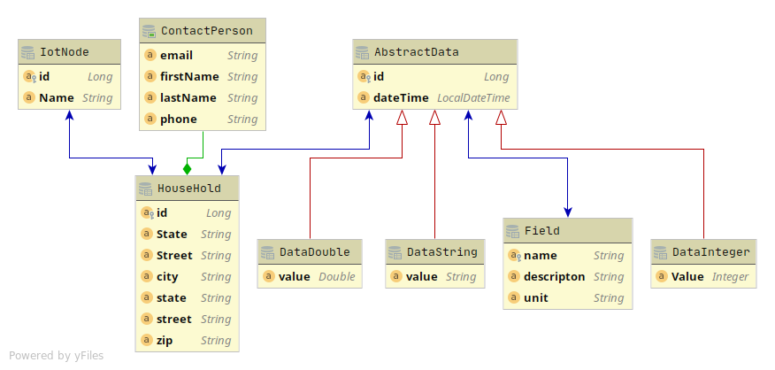
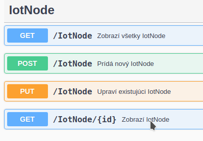

## Úloha na dopracovanie

- Na dokončenie základnej funkcionality webovej služby treba:
    - doplniť pre triedu `IotNode` o anotácie pre Hibernate, 
    - doplniť triedu `IotNodeDAO` o metódy na prítup do databázy,
    - doplniť triedu `IoTNodeResource`tak aby implemetovala REST rozhranie.

Pre vypracovanie prvej úlohy je potrebné vytvoriť obojsmerný vzťah `One-to-Many`. [Viac informácii nájdete tu.](https://www.baeldung.com/hibernate-one-to-many)

Celkovová schéma diagram:

RESTové rozhranie, ktoré ma byť tvorené `IoTNodeResource` je nasledovné:

### Dobrovoľná úloha:

Vytvoreného klienta z prvého zadania upravte tak aby preposielal dáta z WeatherstationServis v intervale 1 minúty na vytvorenú webovú službu (Stačí ked vyberiete 3 ľubovolné premenné, ktoré sa budú preposielať). 